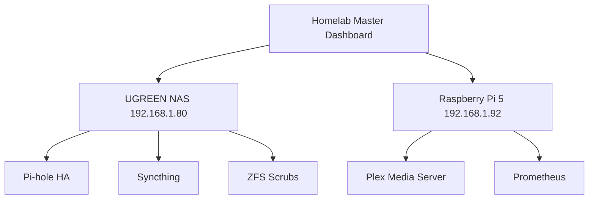

# Project 100: Homelab Master Unified Orchestration Dashboard & Swarm CLI

This is the crowning capstone of the 100-project homelab ecosystem. A centralized master CLI (`swarm_cli.py`) and interactive real-time dashboard server (`dashboard_server.py`) that unifies and audits all 100 homelab sentinels, daemons, collectors, and pipelines.

## Ecosystem Architecture

## CLI Command Reference

The `swarm_cli.py` utility can be used with the following flags:
- `--status`: Tabular cluster overview of all services
- `--check`: Runs automated self-test across critical homelab endpoints
- `--audit`: Validates ecosystem invariants (e.g., DNS Option 6, BitTorrent TCP-only, spindown standby, storage tiers)
- `--export-matrix <path>`: Generates machine-readable JSON/YAML matrix of all 100 homelab projects
- `--dry-run`: Simulate execution without making changes
- `--json`: Output results in JSON format

## Service Catalog Matrix
(Dynamically generated by the CLI via `--export-matrix`)

## Runbooks

1. **Dashboard Start**: Run `docker-compose up -d` to launch the dashboard.
2. **Audit Check**: Run `python swarm_cli.py --audit` to manually check all invariants.
