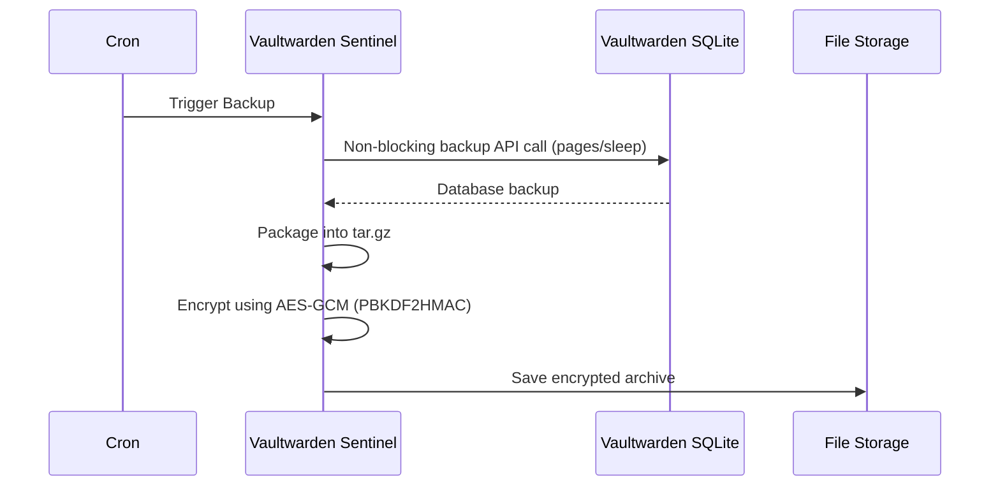

# Vaultwarden Secrets Sentinel & Backup Manager

## Overview
This ecosystem provides automated backup, vault encryption audit, and a health sentinel for Vaultwarden. It is designed to run isolated and non-blocking against a Vaultwarden instance.

## Architecture



## Setup & Deployment
Run the sentinel via Docker Compose:
```bash
docker-compose up -d
```
The sentinel service runs as a daemon exposing Prometheus metrics on port 9126 (`homelab_vaultwarden_backup_success`, `homelab_vaultwarden_db_size_bytes`, `homelab_vaultwarden_attachments_total`).

## Disaster Recovery Restore Instructions
In an emergency, restore the backup by following these steps:

1. Decrypt the archive:
   Extract the salt, nonce, and ciphertext from the encrypted `.enc` file, then reverse the AES-GCM encryption with your emergency passphrase. (You can write a simple Python script to achieve this, using `AESGCM`).
2. Extract the archive:
   ```bash
   tar -xzf db_backup.tar.gz
   ```
3. Replace the Vaultwarden SQLite file:
   Ensure Vaultwarden is stopped, replace `db.sqlite3` with the recovered file, and start the service.

## Runbook
- `python vault_sentinel.py --audit-now`: Run an immediate scan of attachments.
- `python vault_sentinel.py --backup-now`: Run an immediate backup and encryption.
- `python vault_sentinel.py --daemon`: Run the Prometheus metric server on port 9126.
