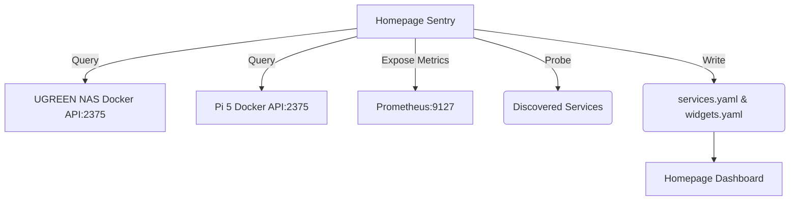

# Homepage Sentry

Homepage Service Discovery & Dashboard Sentry. Automatically scans Docker containers on configured cluster nodes (e.g., UGREEN NAS and Pi 5), tests their availability, and generates Homepage dashboard YAML configurations.

## Architecture



## Homepage Widget Schema

The generated `services.yaml` creates entries using this schema for Homepage:

```yaml
- Discovered Services:
  - service_name:
      icon: docker
      href: http://ip:port
      description: "Image: image_name"
      ping: http://ip:port
```

## Runbook

### Running Sentry

1. Ensure the Python environment is set up.
2. Run a one-time scan and generate configs:
   ```bash
   python3 homepage_sentry.py --generate-config --verify-tiles --scan-now
   ```
3. Run as a long-lived service exposing Prometheus metrics on `9127`:
   ```bash
   docker-compose up -d
   ```
