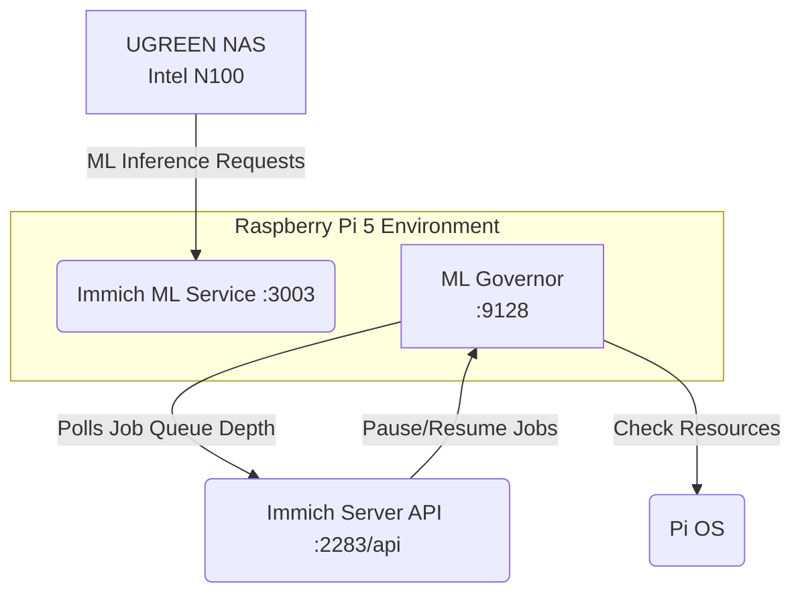

# Immich ML Offloader & Inference Governor

This utility offloads and governs heavy Immich machine learning tasks (like CLIP vector embeddings and facial recognition) from the UGREEN NAS (Intel N100) to a Raspberry Pi 5 (16GB RAM) via the Immich ML REST API (:3003).

By sandboxing the ML tasks and managing dynamic throttling based on host usage, it prevents CPU and thermal spikes on the NAS, and limits memory pressure on the Pi 5.

## Architecture & Offloading Topology



## Setup and Resource Throttling Runbook

### Prerequisites
- Docker & Docker Compose
- Immich API key generated from the Immich Web UI.

### Installation & Throttling
1. Spin up the ML Governor service:
   ```bash
   docker-compose up -d
   ```
2. The ML governor will start sandboxed with a strictly enforced memory limit of 128M.
3. The Governor service will poll API jobs using its client config.
4. If CPU usage goes beyond 80% or memory usage transcends 90%, it triggers `pause` endpoints on the Immich REST API for resource-heavy inference tasks like `facialRecognition`, `smartSearch`, and `metadataExtraction`.
5. Prometheus metrics are exposed at `http://<pi_ip>:9128`
   - `homelab_immich_ml_jobs_queued`
   - `homelab_immich_ml_jobs_processed_total`
   - `homelab_immich_ml_throttled_state`

### Immich API Schema
The endpoints we use to control jobs:
- `GET /api/jobs`: Gets statistics on current jobs.
- `PUT /api/jobs/{jobName}/pause`: Pauses processing of the given job type.
- `PUT /api/jobs/{jobName}/resume`: Resumes processing of the given job type.

Job names targeted:
- `facialRecognition`
- `smartSearch`
- `metadataExtraction`
