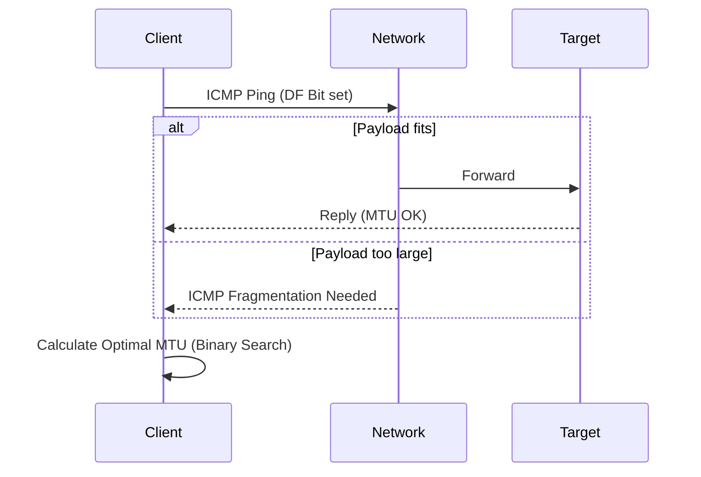

# Homelab WireGuard Split-Tunnel Route & MTU Optimizer

This project provides a WireGuard tunnel performance and MTU optimizer designed for remote homelab access across cellular and hotel networks.

It continuously probes path MTU, measures latency and packet loss, computes optimal MSS/MTU (1280-1420), and verifies that local-only DNS is enforced with zero public DNS leaks.

## Architecture



## Network Directives

### DNS Protection Rules
The system strictly verifies that DNS queries resolve *only* via the designated local Pi-holes (`192.168.1.80` and `192.168.1.92`). If public DNS upstreams are detected in the resolver config, a DNS leak is flagged, as this would expose internal query patterns and fail the local-only invariant.

## Runbook

### Setup
1. Deploy with Docker Compose: `docker-compose up -d`
2. Metrics are exported on port 9129.

### CLI Usage
- Run tests directly via script:
  ```bash
  python route_optimizer.py --probe-now --target-peer 10.0.0.1
  ```
- Output in JSON format:
  ```bash
  python route_optimizer.py --json
  ```
- Dry run (no metrics exported):
  ```bash
  python route_optimizer.py --probe-now --target-peer 10.0.0.1 --dry-run
  ```
