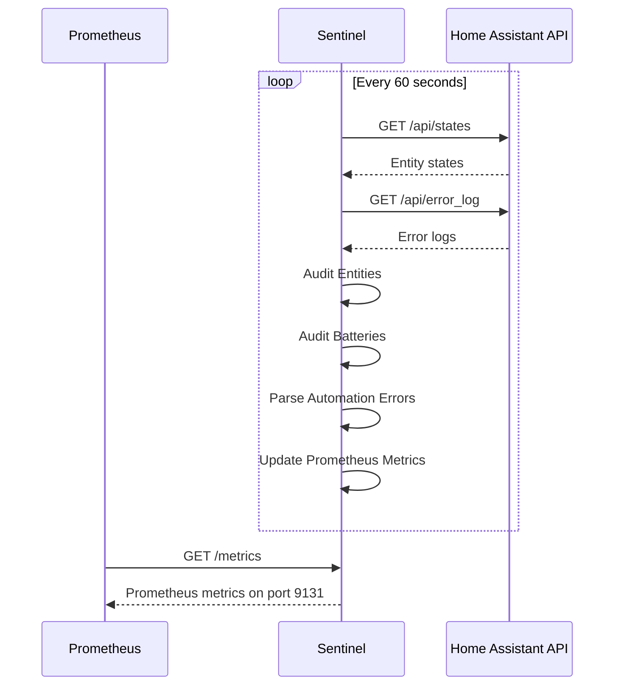

# Homelab Home Assistant Entity & Sensor Invariant Sentinel

The Homelab Home Assistant Entity & Sensor Invariant Sentinel is a containerized Python utility designed to monitor and audit the health of your Home Assistant setup. It specifically looks for entities that are unavailable or in an unknown state, sensors with critically low battery (<20%), and repeated automation failure loops.

## Architecture

The Sentinel connects to the Home Assistant REST API to fetch current state data and error logs. It processes this information to find anomalies and exports metrics via a Prometheus server for easy integration into an existing monitoring stack.



## Entity State Taxonomy

The Sentinel flags entities based on the following taxonomy:
- **Unavailable/Unknown Entities:** Any entity where the `state` is exactly `"unavailable"` or `"unknown"`.
- **Low Battery Sensors:** Entities matching any of the following criteria and having a calculated battery level < 20%:
  - The `entity_id` contains `"battery"`.
  - The entity attributes have `device_class: battery`.
  - The entity attributes include a `battery_level` key.

## Runbook

### Prerequisites
- Python 3.9+
- A valid long-lived access token from your Home Assistant instance.
- The `requests` and `prometheus_client` Python packages.

### CLI Usage
You can run the script manually to perform a one-time audit or to start the daemon process.

```bash
# Run a single audit and output results in JSON
python hass_sentinel.py --hass-url http://your-hass-url:8123 --token YOUR_TOKEN --audit-now --json

# Run continuously as a daemon, exposing Prometheus metrics on port 9131
python hass_sentinel.py --hass-url http://your-hass-url:8123 --token YOUR_TOKEN
```

### Docker
A `docker-compose.yml` file is provided. You must set your environment variables before running it.

```bash
export HASS_URL="http://your-hass-url:8123"
export HASS_TOKEN="YOUR_TOKEN"
docker-compose up -d
```
