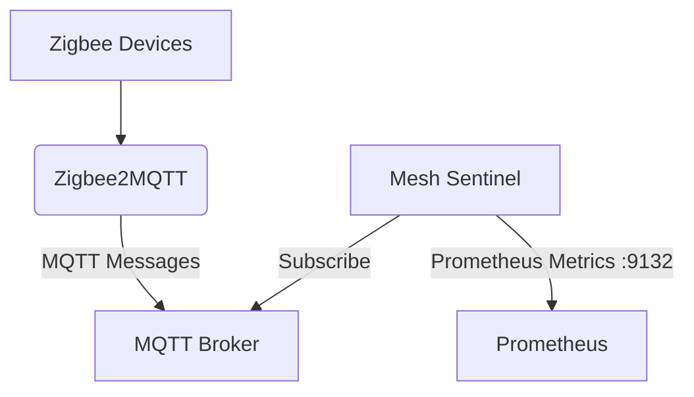

# Homelab Zigbee & Z-Wave MQTT Mesh Health Sentinel

## Architecture

This project provides an isolated, containerized Python utility to monitor Zigbee2MQTT (and potentially ZWave-JS) MQTT message buses. It listens passively to existing topics to evaluate mesh health without injecting intrusive polls.



## LQI Evaluation Thresholds
- **LQI < 50**: Degraded Link. Flagged as a weak mesh link.
- **LQI >= 50**: Acceptable/Good Link.

## Runbook

### Running the Exporter
To start the exporter in a container, use Docker Compose:
```sh
docker-compose up -d
```
The exporter will expose Prometheus metrics on port `9132`.

### CLI Options
You can run the script manually with various options:
- `--audit-now`: Run a one-time audit and print results.
- `--broker <host>`: Specify MQTT broker host.
- `--port <port>`: Specify MQTT broker port.
- `--dry-run`: Do not expose Prometheus metrics.
- `--json`: Output audit report in JSON format.

Example:
```sh
python mesh_sentinel.py --broker localhost --port 1883 --audit-now --json
```
