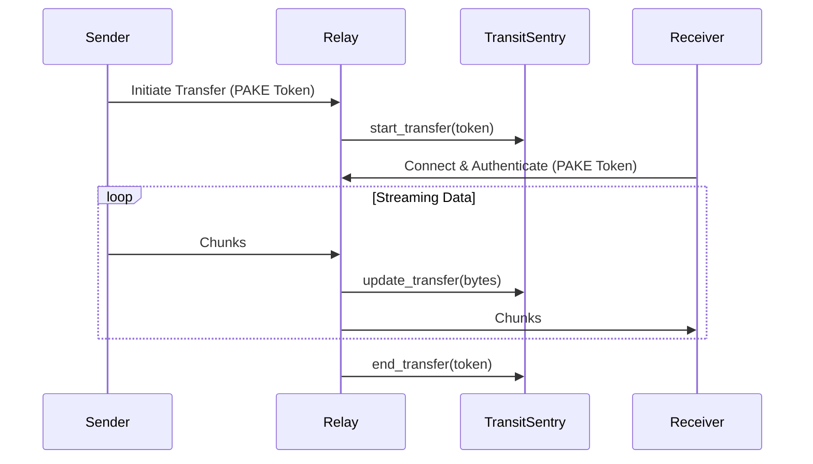

# Homelab Encrypted P2P Wormhole Relay & Transit Sentry

## Ecosystem Purpose
Secure peer-to-peer file transit relay and ephemeral transfer sentinel across homelab nodes and mobile clients using PAKE / Wormhole protocol. Monitors active transfer streams, enforces bandwidth limits, and cleans up staging buffers automatically to protect NVMe endurance.

## Storage Safeguards
- **NVMe Fast Scratch:** Ephemeral transfers staged strictly in RAM or NVMe scratch tier, zero HDD spin-up.
- **Zero Host Mutation:** Isolated containerized Python utility.

## Architecture & Transfer Lifecycle

## Security Token Lifecycle
1. Generated via PAKE by the sending client.
2. Verified during handshake by the receiving client.
3. Tracked by `TransitSentry` during active transit.
4. Auto-expires and buffers pruned by `StorageCleaner` after 1 hour (default).

## Runbook
- Start Relay: `docker-compose up -d`
- Metrics: Exposed on `http://localhost:9133/metrics`
- Manual Audit: `python wormhole_relay.py --audit-now --json`
