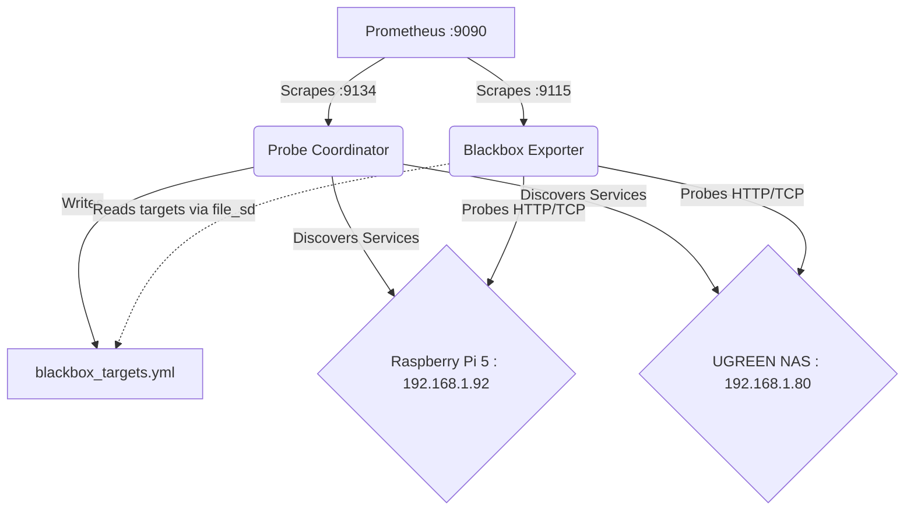

# Homelab Synthetic Blackbox Probe Coordinator

Automated synthetic probe generator and Blackbox exporter coordinator for Prometheus (:9090). Dynamically surveys all running homelab HTTP/gRPC/TCP services across Raspberry Pi 5 (192.168.1.92) and UGREEN NAS (192.168.1.80), synthesizes validated `blackbox_targets.yml`, and continuously evaluates service reachability and TLS certificate validity.

## Architecture Guide

The coordinator is built as an isolated Python utility focusing on Zero Host Mutation and Observability-First principles. It has the following components:

- **Service Discovery Surveyor**: Scans specific subnets or hosts (Raspberry Pi 5 and UGREEN NAS) to discover running HTTP/gRPC/TCP endpoints.
- **Target Config Synthesizer**: Generates standard Prometheus Blackbox probe configurations. Outputs configurations utilizing modules like `http_2xx`, `tcp_connect`, etc.
- **Probe Evaluator**: Performs synthetic reachability checks, testing connections to ensure services are correctly routed.
- **Prometheus Exporter**: Exposes custom metrics on port `9134`. Includes metrics such as `homelab_blackbox_targets_total` and `homelab_blackbox_probes_healthy_ratio`.

### Mermaid Probe Topology



## Schema

Target schema emitted by `Target Config Synthesizer` to `blackbox_targets.yml`:

```yaml
- targets:
    - "http://192.168.1.92:8080"
  labels:
    module: http_2xx
- targets:
    - "192.168.1.80:5432"
  labels:
    module: tcp_connect
```

## Runbook

Run the coordinator locally using Python:
```bash
python probe_coordinator.py --scan-now --output-config blackbox_targets.yml
```

Or run via Docker Compose with memory constraints:
```bash
docker-compose up -d
```
