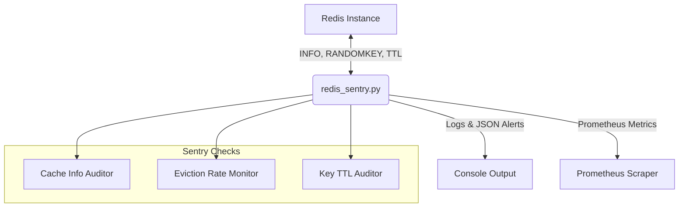

# Homelab In-Memory Cache & Key Space Sentry

## Overview
Automated memory consumption and key space monitor for Redis instances supporting Immich, n8n, and backend caching layers on UGREEN NAS NVMe tier and Raspberry Pi 5.

### Features
- Detects memory ceiling saturation, runaway TTL leaks, and high key eviction rates.
- Uses non-blocking queries via `INFO` and `MEMORY USAGE` safely.
- Standalone, zero-host mutation Python utility.
- Exposes Prometheus metrics on port `9135`.

## Architecture Guide



## Runbook

### Local Testing / Dry-Run
Run a single audit check without outputting side effects using the dry-run flag:
```bash
python3 redis_sentry.py --audit-now --dry-run
```

### Running as a Daemon
To start the sentry with the Prometheus exporter on port 9135:
```bash
python3 redis_sentry.py --redis-host <YOUR_REDIS_HOST> --redis-port 6379
```

### Using Docker
You can easily spin up the utility via the provided `docker-compose.yml`:
```bash
docker-compose up -d
```
The container is limited to 128MB of RAM for strict resource control.

### Metrics Exporter
The Prometheus exporter listens on port `9135` by default, exposing the following metrics:
- `homelab_redis_memory_used_bytes`
- `homelab_redis_evicted_keys_total`
- `homelab_redis_connected_clients`

## Tests
To run the automated tests:
```bash
pytest tests/test_redis_sentry.py
```