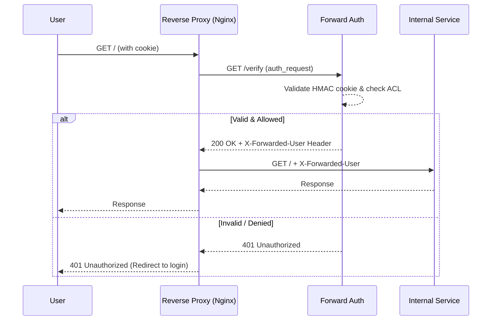

# Forward Auth Middleware Gatekeeper

Lightweight zero-trust forward-authentication middleware for internal reverse proxies (e.g., Nginx Proxy Manager). This tool intercepts inbound web traffic, validates signed HMAC/JWT session cookies, enforces authorization roles, and passes sanitized headers to internal services.

## Architecture



## Nginx Configuration Example

```nginx
# Define the auth_request directive for a protected location
location / {
    auth_request /auth_verify;

    # Extract user from forward-auth response and pass to upstream
    auth_request_set $auth_user $upstream_http_x_forwarded_user;
    proxy_set_header X-Forwarded-User $auth_user;

    proxy_pass http://internal_service;
}

# Define the /auth_verify endpoint
location = /auth_verify {
    internal;
    proxy_pass http://forward-auth:9136/verify;
    proxy_pass_request_body off;
    proxy_set_header Content-Length "";
    proxy_set_header X-Original-URI $request_uri;
    proxy_set_header X-Forwarded-Host $host;
}
```

## Runbook

1.  **Deployment**:
    *   Set a strong secret key for the HMAC validation.
    *   Deploy using Docker Compose: `docker-compose up -d`
2.  **Monitoring**:
    *   Prometheus metrics are exposed at `http://<host>:9136/metrics`.
    *   Key metrics: `homelab_auth_requests_total`, `homelab_auth_allowed_total`, `homelab_auth_denied_total`.
3.  **Operation Mode**:
    *   The service can be run locally for testing via `python forward_auth.py --port 9136 --secret-key my_secret`.
    *   Additional flags available for tests: `--dry-run`, `--check-now`, `--json`.
