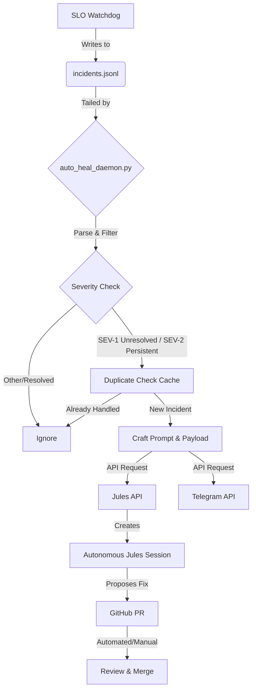

# SLO Watchdog Auto-PR Self-Healing Hook

This project implements an autonomous self-healing bridge for the homelab or production environment. It monitors the SLO Watchdog incident logs, identifies critical severity issues, and dispatches an autonomous Jules agent session via a GitHub/Jules API to attempt remediation and open a pull request.

## Architecture

The system consists of a Python daemon running as a systemd service that tails a JSONL log file of incidents. When a SEV-1 or persistent SEV-2 incident is detected, it crafts a remediation prompt and dispatches an API call to Jules, as well as an alert to Telegram. Duplicate detection is implemented to prevent dispatching multiple sessions for the same incident.

### Flowchart



## Setup

1. Copy `systemd/slo-auto-heal.service` to `/etc/systemd/system/`.
2. Update the paths in the service file and daemon if necessary.
3. Configure environment variables (e.g. `JULES_API_URL`, `JULES_API_KEY`, `TELEGRAM_BOT_TOKEN`, `TELEGRAM_CHAT_ID`).
4. Enable and start the service: `systemctl enable --now slo-auto-heal.service`

## Testing

Run the tests using pytest:

```bash
PYTHONPATH=projects/31-slo-auto-heal pytest projects/31-slo-auto-heal/tests/
```
