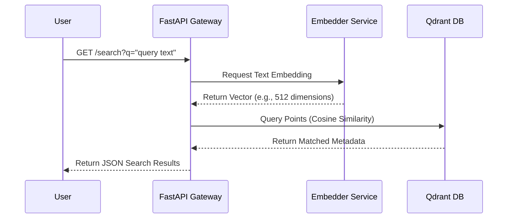

# OmniSearch Unified Gateway (API & Dashboard)

This project provides the central gateway for OmniSearch, a natural language media search engine. It features a FastAPI application acting as a central hub between the user, the embedding model, and the Qdrant vector database.

## Architecture

The gateway serves both an HTML front-end and a REST JSON API.



## Setup & Execution

### 1. Start Service

Ensure you have Docker and Docker Compose installed.

```bash
cd projects/32-omnisearch-api
docker-compose up -d
```

The service will bind to port `8008`.

### 2. Access the Dashboard

Open your browser and navigate to `http://localhost:8008/` to access the lightweight single-page HTML interface with an instant search bar.

### 3. API Endpoints

- `GET /search?q={query}&limit={limit}&threshold={threshold}`: Natural language query endpoint.
- `GET /health`: Health probe reporting status of Qdrant connection and embedder service.

## Testing

Run tests using pytest:

```bash
pytest projects/32-omnisearch-api/tests/test_server.py
```
