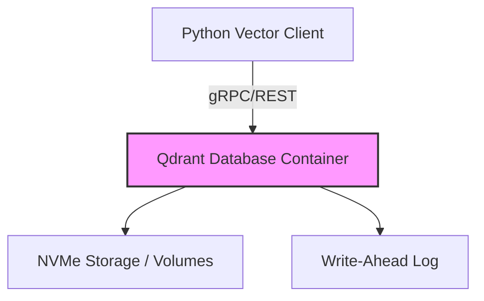

# OmniSearch Qdrant Vector Engine

This project sets up the Qdrant vector database optimized for OmniSearch, along with a robust Python client.

## Architecture Diagram



## Setup & Execution

### 1. Start Qdrant

Ensure you have Docker and Docker Compose installed.

```bash
cd projects/32-omnisearch-qdrant
docker-compose up -d
```

### 2. Client Usage

The `OmniSearchClient` manages collections, batch upserts, and vector searches.

```python
from vector_client import OmniSearchClient

client = OmniSearchClient(host="localhost", port=6333, grpc_port=6334)

# Initialize Collection
# 512 for MobileCLIP, 768 for SigLIP
client.init_collection("media_frames", vector_size=512)

# Batch Upsert Example
points = [
    {
        "id": 1,
        "vector": [0.1] * 512,
        "payload": {
            "file_path": "/media/photos/IMG_001.jpg",
            "timestamp_sec": 1690000000.0,
            "item_type": "photo",
            "title": "Beach Sunset",
            "tags": ["beach", "sunset", "ocean"]
        }
    }
]
client.batch_upsert("media_frames", points)

# Search Query Example
results = client.search(
    collection_name="media_frames",
    query_vector=[0.1] * 512,
    top_k=5,
    threshold=0.7,
    filter_dict={"item_type": "photo"}
)
print(results)
```

## Performance Specs

- Optimized for NVMe via direct file system mapping.
- Memory thresholds configurable via Docker Compose WAL capacity (default 32MB limits).
- Expected ~10ms query latency for <1M vectors with payload indexing.

## Testing

Run tests using pytest:

```bash
pytest projects/32-omnisearch-qdrant/tests/test_vector_client.py
```
