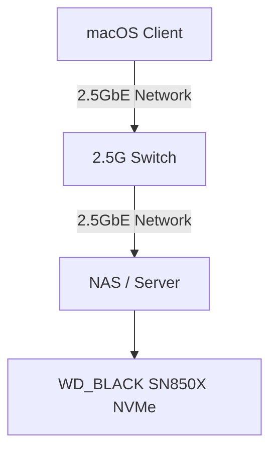

# Project 33: High-Speed 2.5GbE Mac NVMe Scratch Disk Suite

This project provides tools for optimizing and benchmarking a high-speed 2.5GbE NVMe scratch disk suite mounted on macOS.

## Architecture



## macOS Mount Commands

To mount the scratch disk from your macOS terminal, use the following commands:

```bash
# Create mount point
mkdir -p /Volumes/scratch

# Mount the SMB share (replace credentials and IP)
mount_smbfs //username:password@server_ip/scratch /Volumes/scratch
```

## Benchmark Baselines

For a 2.5GbE network connection, the theoretical maximum throughput is approximately 312.5 MB/s. After network overhead, expect the following baselines:

- **Sequential Read**: ~280 MB/s
- **Sequential Write**: ~280 MB/s
- **Random 4K IOPS**: Network dependent, expect latency to be a primary bottleneck compared to local NVMe, but still significantly faster than HDD.

## Disaster Recovery

If the mount fails or performance degrades significantly:

1. **Verify Network Connectivity**: Check link speed on both Mac and NAS to ensure they negotiated at 2500Base-T.
2. **Re-run Optimizer**: Execute `python3 mac_smb_optimizer.py` to ensure `nsmb.conf` and sysctl parameters haven't been reset by a macOS update.
3. **Check Permissions**: Ensure the server-side export (e.g., `/volume2/scratch`) still has correct Read/Write/Execute permissions.
4. **Remount**: Unmount cleanly `umount /Volumes/scratch` and remount.
