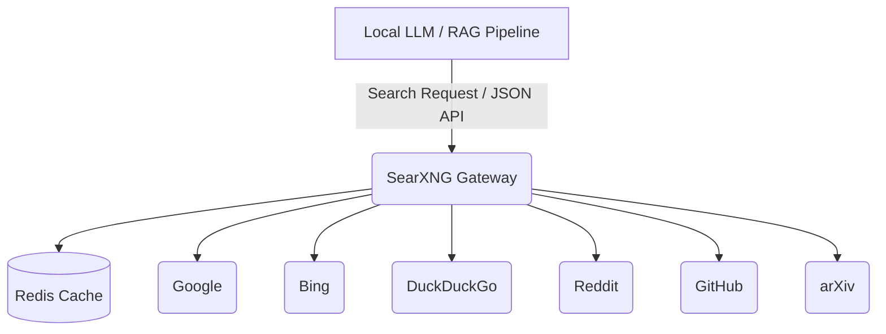

# SearXNG Private Meta-Search Gateway

A privately hosted SearXNG instance optimized for Retrieval-Augmented Generation (RAG) pipelines and LLM integrations. It aggregates multiple search engines, removes tracking, and provides clean JSON/markdown outputs.

## Architecture



## Setup

Start the services with Docker Compose:

```bash
docker-compose up -d
```

The gateway will be accessible at `http://localhost:8888`.

## Health Check

Check the status of the gateway using `curl`:

```bash
curl -I http://localhost:8888/
```

Check the search functionality and JSON API:

```bash
curl "http://localhost:8888/search?q=test&format=json"
```

## Local RAG Integration Example

You can use the provided `search_client.py` module to easily integrate the search gateway into your python applications or RAG pipelines.

```python
from search_client import SearXNGClient

client = SearXNGClient(base_url="http://localhost:8888")

# Search and get JSON results
results = client.search(
    query="LLM reasoning capabilities",
    engines=["google", "arxiv"],
    time_range="month"
)
print(results)

# Or get cleanly formatted markdown ready for an LLM prompt
markdown_results = client.search_as_markdown(
    query="latest advancements in quantum computing"
)

prompt = f"Based on the following search results, answer the user's question:\\n\\n{markdown_results}\\n\\nQuestion: What are the latest advancements?"
print(prompt)
```
