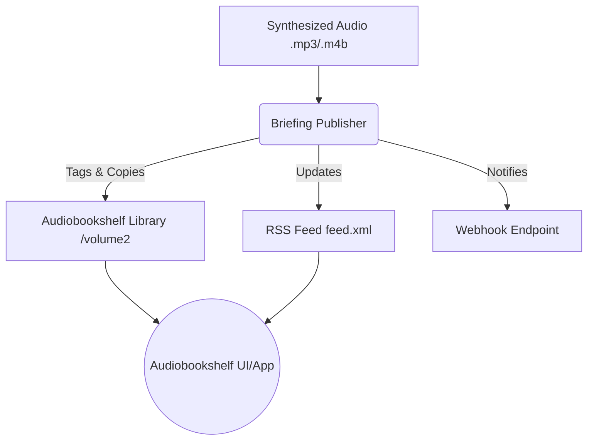

# Project 35: Document-to-Voice Audiobook & Morning Briefing Pipeline

This project provides an automated pipeline for taking synthesized audio (from XTTS or other engines) and ingesting it into Audiobookshelf as a podcast episode or audiobook, complete with RSS feed generation and webhook notifications.

## Architecture & Pipeline



## Docker Compose Setup

The `docker-compose.yml` configures Audiobookshelf to map to port `13378` and mounts directories from the fast NVMe tier (`/volume2`).

### Volume Bindings
- `/volume2/audiobookshelf/audiobooks` -> `/audiobooks`
- `/volume2/audiobookshelf/podcasts` -> `/podcasts`
- `/volume2/audiobookshelf/config` -> `/config`
- `/volume2/audiobookshelf/metadata` -> `/metadata`

## Briefing Publisher API

The `briefing_publisher.py` script contains a `BriefingPublisher` class that can be integrated into other python scripts or run directly.

### Initialization
```python
from briefing_publisher import BriefingPublisher
publisher = BriefingPublisher(library_dir="/volume2/audiobookshelf", webhook_url="http://optional.webhook/url")
```

### `publish_briefing(audio_file, metadata, is_podcast=True)`
Publishes an audio file to the library.

**Arguments:**
- `audio_file` (str): Path to the source `.mp3` or `.m4b` file.
- `metadata` (dict): Metadata dictionary containing:
  - `title`: Title of the episode/book.
  - `series`: Name of the podcast/series (used for folder grouping).
  - `description`: Description of the episode.
- `is_podcast` (bool): Defaults to `True`. If `True`, creates an RSS feed and places it in the podcasts folder. If `False`, places it in the audiobooks folder.

## Live Verification Commands

1. **Start Audiobookshelf:**
   ```bash
   docker-compose -f projects/35-audiobookshelf/docker-compose.yml up -d
   ```

2. **Verify Container Running:**
   ```bash
   docker ps | grep audiobookshelf
   curl -I http://localhost:13378
   ```

3. **Run Publisher Tests:**
   ```bash
   python3 -m pytest projects/35-audiobookshelf/tests/test_briefing_publisher.py
   ```
