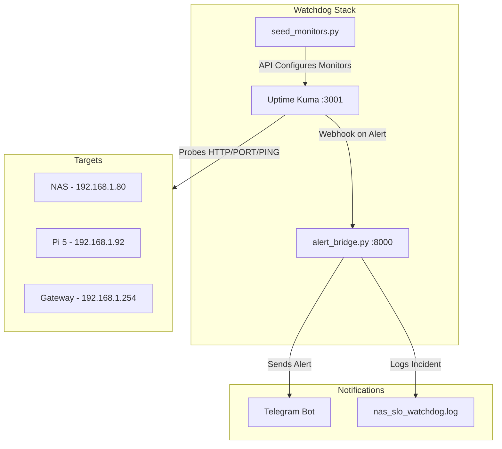

# Uptime Kuma Homelab Watchdog & Unified Sentry

This project provides an automated, centralized monitoring solution for a homelab environment using Uptime Kuma. It includes scripts to dynamically seed monitors for over 30 services across multiple hosts and an alert bridge to dispatch notifications.

## Architecture



## Environment Variables

### For `seed_monitors.py`
- `KUMA_URL`: URL of the Uptime Kuma instance (default: `http://localhost:3001`).
- `KUMA_USER`: Admin username for Uptime Kuma (default: `admin`).
- `KUMA_PASS`: Admin password for Uptime Kuma (default: `admin`).

### For `alert_bridge.py`
- `TELEGRAM_BOT_TOKEN`: Token for your Telegram bot.
- `TELEGRAM_CHAT_ID`: Chat ID to send notifications to.
- `NAS_SLO_WATCHDOG_LOG`: Path to the local incident log file (default: `nas_slo_watchdog.log`).

## Startup Commands

1. **Start Uptime Kuma:**
   ```bash
   docker-compose up -d
   ```

2. **Seed Monitors:**
   Ensure Uptime Kuma is running and you have completed the initial setup (created admin user). Then run:
   ```bash
   python seed_monitors.py
   ```

3. **Start Alert Bridge:**
   ```bash
   python alert_bridge.py
   ```

## Disaster Recovery

If the monitoring stack goes down:
1. Ensure the host running the `docker-compose` stack is up.
2. Check Uptime Kuma logs: `docker logs uptime-kuma`.
3. If data is corrupted, Uptime Kuma's SQLite database is located in `./data/kuma.db`. Restore from a backup if necessary.
4. To recreate monitors quickly on a fresh install, re-run `python seed_monitors.py`.
5. Verify webhook settings in Uptime Kuma point to the `alert_bridge.py` endpoint (`http://<host>:8000/webhook`).
