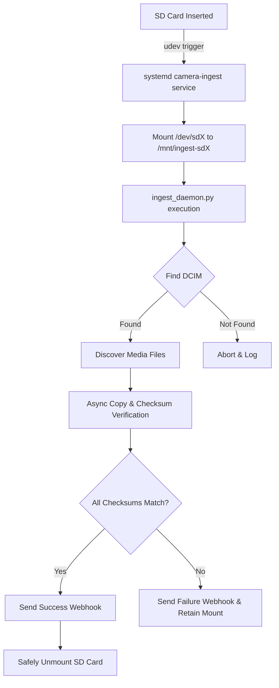

# Zero-Touch SD Card Camera Ingest Box

This project implements an automated, zero-touch ingestion service for camera SD cards. Upon insertion, it detects the `DCIM` directory, recursively syncs supported media files (RAW, JPEG, MP4) to a destination directory, verifies data integrity with SHA-256 checksums, unmounts the drive safely, and optional sends a Telegram notification.

## Features
- **Auto-Discovery:** Locates `DCIM` directory regardless of placement.
- **Concurrent Sync:** Copies media asynchronously for fast transfers.
- **Checksum Verification:** Guarantees zero data corruption during transit.
- **Auto-Unmount:** Unmounts the device automatically upon success.
- **Notifications:** Supports Telegram webhooks for instant summaries (transferred count, gigabytes).

## Flow Diagram



## Setup Instructions

1. **Install Python Dependencies:**
   Ensure `aiohttp` is installed.
   ```bash
   pip3 install aiohttp
   ```

2. **Deploy Daemon Code:**
   Place `ingest_daemon.py` in an appropriate directory (e.g., `/opt/camera-ingest/ingest_daemon.py`).

3. **Install Udev Rules:**
   Copy `udev/99-camera-sd-ingest.rules` to `/etc/udev/rules.d/`.
   ```bash
   sudo cp udev/99-camera-sd-ingest.rules /etc/udev/rules.d/
   sudo udevadm control --reload-rules
   ```

4. **Install Systemd Service:**
   Copy `systemd/camera-ingest.service` to `/etc/systemd/system/` (update paths inside if your setup differs).
   ```bash
   sudo cp systemd/camera-ingest.service /etc/systemd/system/
   sudo systemctl daemon-reload
   ```

## Testing

A comprehensive `pytest` suite is provided to verify correct behavior using mocked file systems. To run the tests:

```bash
cd projects/37-camera-ingest
PYTHONPATH=. python3 -m pytest tests/test_ingest_daemon.py
```
