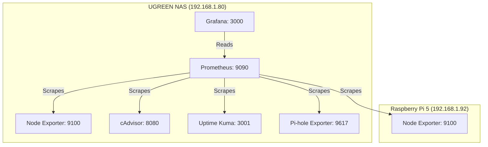

# Project 41: Unified Homelab Observability Suite

## Architecture

## Runbook

### Service Details
* **Prometheus:** http://192.168.1.80:9090
* **Grafana:** http://192.168.1.80:3000
    * Default Login: admin / admin
    * Anonymous read-only viewing is enabled
* **Node Exporter:** http://192.168.1.80:9100 (Host metrics)

### Scrape Endpoint Matrix
| Service | Endpoint | Interval |
|---------|----------|----------|
| NAS Node Exporter | `192.168.1.80:9100` | 15s |
| Pi 5 Node Exporter | `192.168.1.92:9100` | 15s |
| Uptime Kuma | `192.168.1.80:3001/metrics` | 15s |
| cAdvisor | `192.168.1.80:8080/metrics` | 15s |
| Pi-hole Exporter | `192.168.1.80:9617/metrics` | 15s |

### Alert Baselines
* **CPU Thermal:** Alert if temperature exceeds 80C on either NAS or Pi 5.
* **NVMe Utilization:** Alert if write IOPS exceed 5000 consistently for > 5m.
* **RAM Allocation:** Alert if available RAM drops below 15%.
* **Pi-hole Block Rate:** Watch for sudden drops which might indicate DNS bypassing.

### Getting Started
1. Start the stack: `docker compose up -d`
2. Access Grafana and view the pre-provisioned "Homelab Overview" dashboard.
