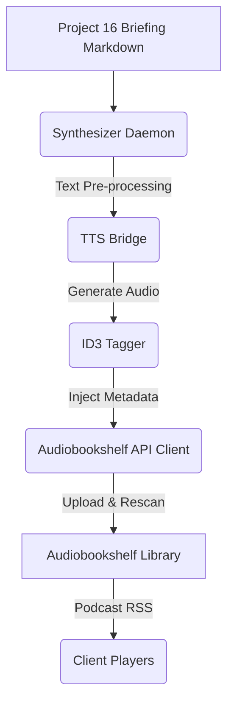

# Project 42: Automated Morning Briefing Audio Synthesizer & Audiobookshelf Ingest Daemon

This project is responsible for consuming daily morning briefing markdown generated by Project 16, synthesizing it into an audio podcast track, tagging it properly, and publishing it directly to Audiobookshelf.

## Architecture



## Setup & Environment

Set these environment variables before running:
- `ABS_URL`: Audiobookshelf base URL (default: `http://192.168.1.80:13378`)
- `ABS_USER`: Audiobookshelf username
- `ABS_PASS`: Audiobookshelf password

## Usage

You can run the daemon via command line:
```bash
python synthesizer_daemon.py --briefing-file /path/to/briefing.md
```

Options:
- `--briefing-file <path>`: Required. Path to the markdown file to process.
- `--dry-run`: Generates the audio but does not upload to Audiobookshelf.
- `--force-publish`: Attempts to continue processing even if some steps fail.
