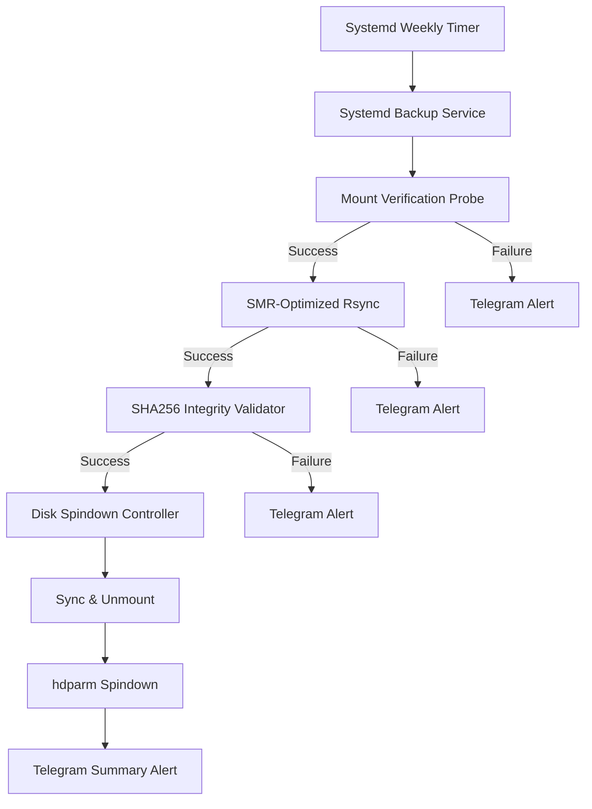

# Cold Backup & SMR Spindown Orchestrator

This project provides an automated, SMR-aware, cold backup orchestration system tailored for homelab environments, specifically designed to mitigate catastrophic write speed degradation on Shingled Magnetic Recording (SMR) drives.

## Target Environment
- **Host**: UGREEN DXP2800 NAS (192.168.1.80, Intel N100, 8GB DDR5 RAM)
- **Source Storage**: 10TB Seagate IronWolf CMR HDD (`/volume1`) & 4TB WD_BLACK SN850X NVMe (`/volume2`)
- **Target Backup Drive**: 8TB Seagate Expansion SMR External USB 3.0 HDD

## Architecture Guide



## SMR Write Amplification Mitigation Details

SMR drives divide disk space into overlapping zones. Modifying a sector within a zone requires reading the entire zone, updating it in cache, and rewriting the entire zone. Random writes cause severe write amplification, dropping performance to KB/s.

To mitigate this, the backup orchestrator enforces:
1.  **Strict Sequential Writing**: Rsync is invoked with `--no-inc-recursive`, which builds the entire file list in memory before starting transfers. This ensures files are written sequentially.
2.  **Bandwidth Throttling**: Rsync is limited with `--bwlimit=60M`. This prevents overwhelming the SMR drive's CMR cache (typically ~256MB), ensuring sustained, predictable write speeds rather than bursting and stalling.
3.  **Single Stream**: Transfers are restricted to a single process (no parallel operations) to avoid interleaving blocks from different files, which would disrupt sequential track writing.

## Spindown Verification

The backup drive is spun down via the orchestrator script using `hdparm -y`, and an idle timeout is enforced by the provided udev rules (`/etc/udev/rules.d/99-smr-spindown.rules`).

To verify the drive state without spinning it up (ensure you use `-n standby`), use the following command (replace `/dev/sdb` with your actual device):

```bash
smartctl -i -n standby /dev/sdb
```
The output should indicate that the device is in standby mode.

## Disaster Recovery Procedures

In the event of a primary array failure:

1.  **Connect Backup Drive**: Connect the 8TB Seagate Expansion drive to a functional system.
2.  **Mount Drive**: Mount the partition containing the backup (e.g., `mount /dev/sdb1 /mnt/recovery`).
3.  **Verify Integrity**: Navigate to the recovery mount point and run `sha256sum -c .backup_manifest.sha256` to ensure no data corruption occurred during rest. Note: Given the scale of data, a full validation may take substantial time; sampling critical files may be sufficient for quick verification.
4.  **Restore Data**: Use `rsync -av /mnt/recovery/ /path/to/new/array/` to restore the files. Avoid writing to the SMR drive during the recovery process.
