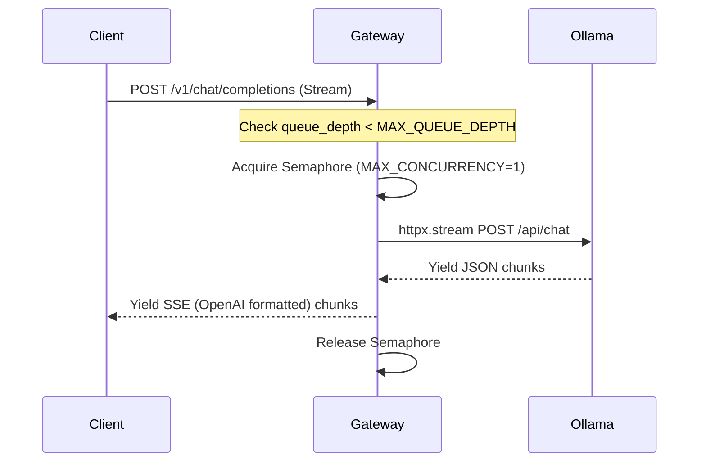

# Project 44: Local LLM API Gateway & Resource Throttler

This is a lightweight async FastAPI proxy to throttle requests to a local AI / LLM inference worker (like Ollama).

It ensures strict concurrency bounds so that Pi-hole v6 FTL or host RAM are not exhausted during heavy LLM use.

## Architecture & Data Flow



## Configuration

* `OLLAMA_BACKEND_URL`: URL of upstream inference engine (default: `http://192.168.1.92:11434`)
* `MAX_CONCURRENCY`: Number of concurrent requests actively processed (default: `1`)
* `MAX_QUEUE_DEPTH`: Maximum queued requests before dropping new ones with 503 (default: `5`)
* `REQUEST_TIMEOUT_SECONDS`: Total time a request is allowed in queue + processing before returning 504 (default: `60`)

## Docker Compose

```yaml
version: '3.8'

services:
  llm-gateway:
    build:
      context: .
      dockerfile: Dockerfile
    container_name: llm-gateway
    restart: unless-stopped
    ports:
      - "8000:8000"
    deploy:
      resources:
        limits:
          cpus: '2.0'
          memory: 1024M
```

## Usage Examples

### Health Check
```bash
curl http://localhost:8000/health
```

### List Models
```bash
curl http://localhost:8000/v1/models
```

### Chat Completion (Streaming)
```bash
curl http://localhost:8000/v1/chat/completions \
  -H "Content-Type: application/json" \
  -d '{
    "model": "llama3",
    "messages": [
      {
        "role": "user",
        "content": "Why is the sky blue?"
      }
    ],
    "stream": true
  }'
```
