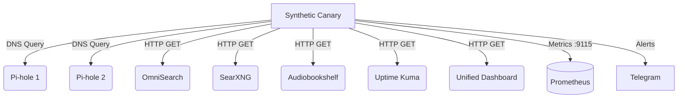

# Project 45: Homelab End-to-End Synthetic Canaries & SLO Monitor

Network availability is Priority #1. Any DNS query taking >500ms or client-facing service outage is a SEV incident.

This project deploys a multi-target synthetic probe runner executing periodic asynchronous probe rounds against Pi-hole DNS resolvers and critical homelab services.

## Architecture



## Probe Configuration

| Target | Endpoint | SLO Target Latency | Alert Threshold | Type |
|--------|----------|-------------------|-----------------|------|
| Pi-hole 1 | 192.168.1.80:53 | < 50ms | > 500ms | DNS |
| Pi-hole 2 | 192.168.1.92:53 | < 50ms | > 500ms | DNS |
| OmniSearch | localhost:8008 | < 200ms | > 1000ms | HTTP |
| SearXNG | localhost:8888 | < 500ms | > 1000ms | HTTP |
| Audiobookshelf| localhost:13378 | < 300ms | > 1000ms | HTTP |
| Uptime Kuma | localhost:3001 | < 100ms | > 1000ms | HTTP |
| Unified Dashboard| localhost:3030 | < 100ms | > 1000ms | HTTP |

## Prometheus Scrape Configuration

Add the following to your `prometheus.yml`:

```yaml
scrape_configs:
  - job_name: 'synthetic_canary'
    scrape_interval: 15s
    static_configs:
      - targets: ['localhost:9115']
```

## Usage

```bash
docker-compose up -d
```
