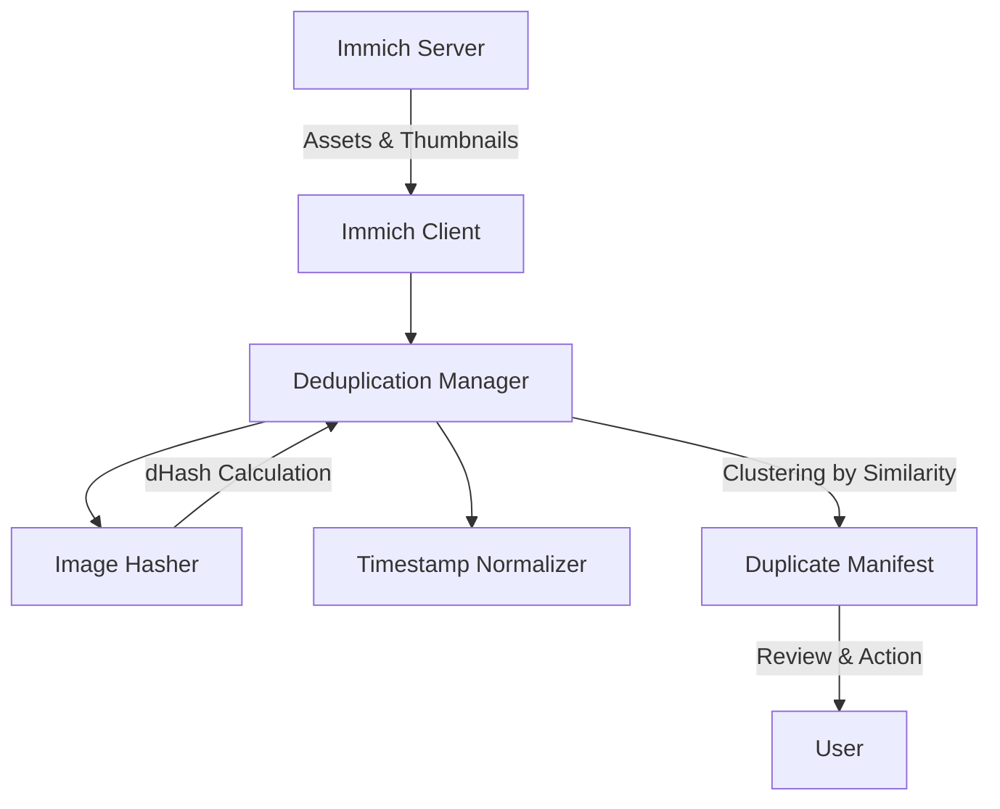

# Automated Immich AI Duplicate Finder & EXIF Normalizer

## Overview

The Photo Curator connects to your Immich instance, retrieves assets, computes a perceptual hash (dHash) for each asset's thumbnail, and clusters images based on a configurable similarity threshold (Hamming distance). It does **not** delete any files. Instead, it exports a `duplicates_review.json` manifest listing the highest-resolution primary image and its duplicates for manual review.

## Architecture



## Setup & Integration

1.  **Immich API Key:** You must create an API key in Immich (Account Settings > API Keys) and provide it to this service.
2.  **Environment Variables:** Provide `IMMICH_URL` and `IMMICH_API_KEY`.
3.  **Similarity Threshold:** The default Hamming distance threshold is 10. A lower threshold requires closer exact matches.

## Execution

```bash
# Run via docker-compose
docker-compose up -d

# Run manually
python photo_curator.py --url http://immich:2283 --api-key YOUR_KEY --dry-run
```

By default, the tool outputs `duplicates_review.json` with grouped duplicate clusters.
