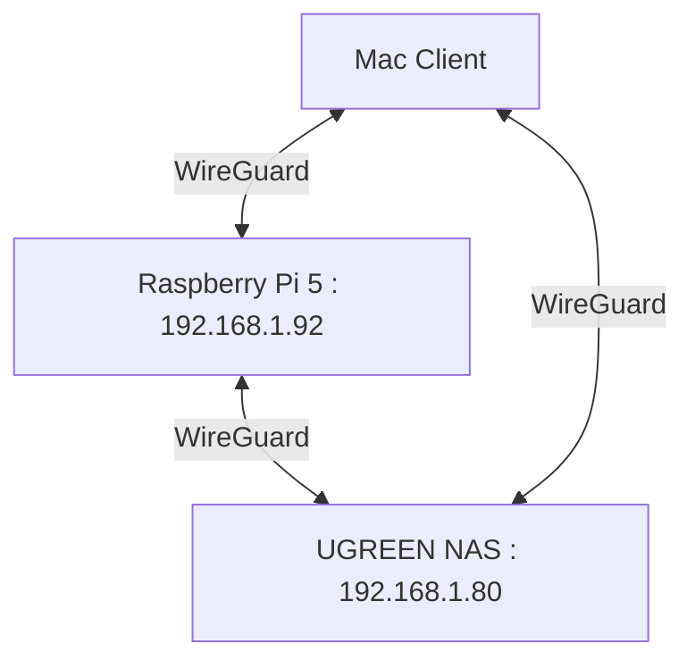

# Project 47: Homelab Mesh VPN & WireGuard Sentry

## Architecture



## Client Configuration (wg0.conf)

```ini
[Interface]
PrivateKey = <CLIENT_PRIVATE_KEY>
Address = 10.13.13.2/32
DNS = 192.168.1.80, 192.168.1.92

[Peer]
PublicKey = <SERVER_PUBLIC_KEY>
Endpoint = <SERVER_ENDPOINT>:51820
AllowedIPs = 0.0.0.0/0, ::/0
PersistentKeepalive = 25
```

## Zero-Leak DNS Policy

**STRICT DIRECTIVE: ZERO PUBLIC DNS LEAKS!**

All WireGuard peers MUST route DNS exclusively to local ad-blocking nodes:
- `192.168.1.80` (UGREEN NAS)
- `192.168.1.92` (Raspberry Pi 5)

Under no circumstances should public upstreams (e.g., `1.1.1.1`, `8.8.8.8`) be configured on the VPN interfaces or within `/etc/resolv.conf`. This is to prevent Android DoT (DNS over TLS) hijacks and ensure all traffic is locally sinkholed through our Pi-hole infrastructure.
