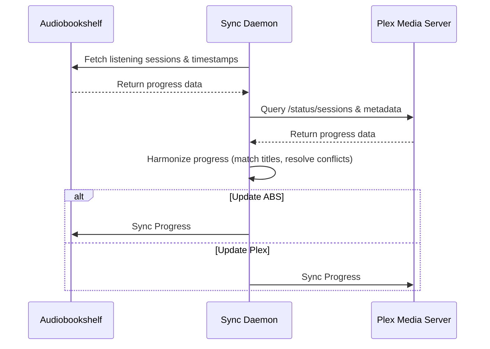

# Audiobookshelf to Plex Media Matcher & Progress Sync

This service provides bi-directional synchronization of playback progress and listen states between Audiobookshelf (podcasts/audiobooks) and Plex (music/podcast libraries).

## Architecture & Sequence

## Setup

1. Configure `ABS_URL`, `ABS_TOKEN`, `PLEX_URL`, and `PLEX_TOKEN` in the environment or `docker-compose.yml`.
2. Run `docker-compose up -d`.

## Conflict Resolution Rules

- Progress is matched between systems using fuzzy title matching.
- The system with the most recently updated timestamp (`updatedAt`) wins.
- Optionally, a direction can be forced using the `--force-direction` CLI flag (`abs-to-plex` or `plex-to-abs`).
