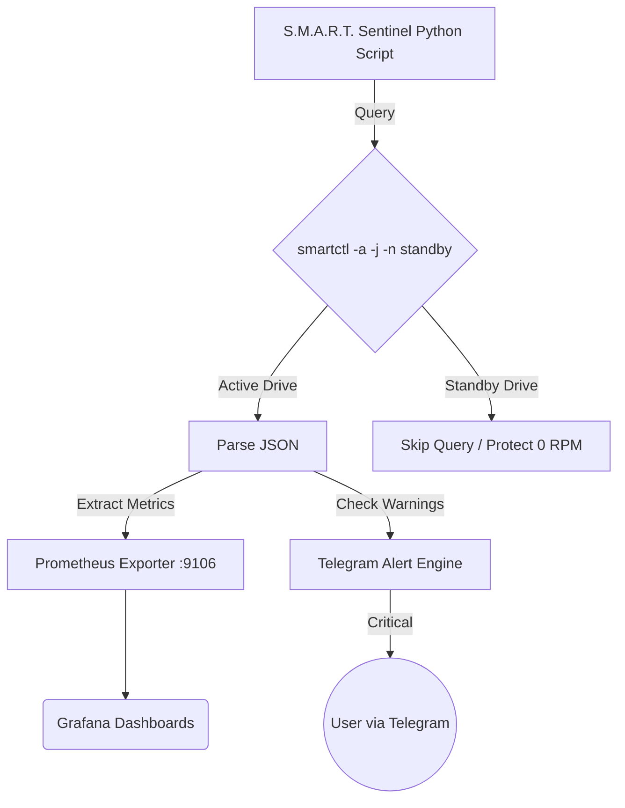

# Automated S.M.A.R.T. NVMe Endurance & HDD Health Sentinel

This project provides an automated S.M.A.R.T. monitoring sentinel designed for NVMe and HDD endurance tracking. It operates with zero host mutation (pure read-only) and respects drive standby states.

## Architecture

## Metrics

- `smart_nvme_percentage_used`: The percentage of NVM subsystem life used.
- `smart_nvme_available_spare`: Normalized percentage of the remaining spare capacity available.
- `smart_nvme_tbw_written_terabytes`: Calculated Terabytes Written (TBW) derived from Data Units Written.
- `smart_hdd_reallocated_sectors`: Number of reallocated sectors on HDDs (critical failing sign).
- `smart_hdd_spin_retry_count`: Spin retry counts on HDDs.
- `smart_drive_temperature_celsius`: Drive temperature.
- `smart_disk_standby_state`: Whether the disk is actively spinning (1) or in standby/sleep (0).

## Alerts

Alerts are sent via Telegram if:
- Drive temperature exceeds 70°C.
- Critical warnings (e.g., critical warning > 0) appear on NVMe drives.
- Reallocated Sectors or Spin Retry Count > 0 on HDDs.
