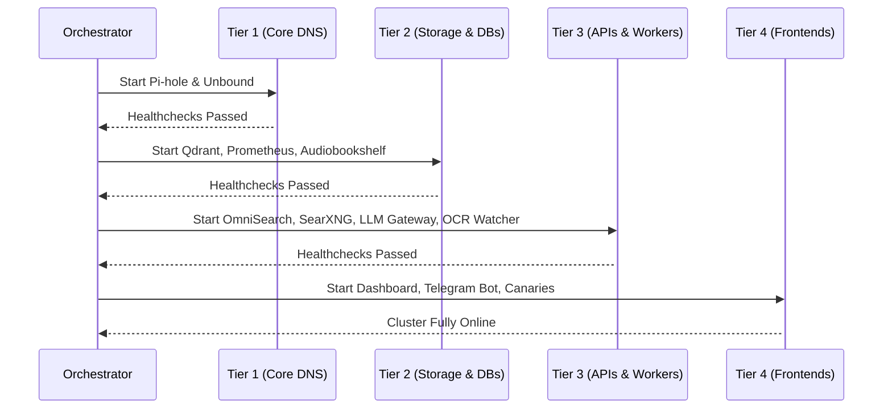

# Project 51: Multi-Service Cluster Orchestrator & Graceful Lifecycle Manager

This cluster orchestrator manages homelab services spanning across a UGREEN DXP2800 NAS and a Raspberry Pi 5. It enforces a strict tiered dependency graph, guaranteeing core infrastructure comes up first and goes down last.

## Features

- **Tiered Sequencing**:
  - **Tier 1:** Core Network / DNS (Pi-hole, Unbound)
  - **Tier 2:** Storage, DBs & Metrics (Qdrant on NVMe, Prometheus, Audiobookshelf)
  - **Tier 3:** APIs & Workers (OmniSearch API, SearXNG, LLM Gateway, OCR Watcher)
  - **Tier 4:** Frontends & Sentry (Unified Dashboard, Telegram Bot, Synthetic Canaries)
- **Graceful Lifecycle Management**: Starts tiers sequentially with health check validation. Stops services in reverse order and guarantees database flushes and filesystem `sync`.
- **Parallel Health Checks**: Rapid status verification across the cluster with human-readable and JSON matrix output.

## Tiered Startup Flow



## Operations

```bash
# Start all tiers in order
python orchestrator.py up

# Dry run start tier 2
python orchestrator.py up --tier 2 --dry-run

# Graceful shutdown (reverse order)
python orchestrator.py down

# Health check
python orchestrator.py health
python orchestrator.py health --json
```

## Cold Boot Procedure

1. Verify network connectivity to NAS (192.168.1.80) and Pi (192.168.1.92).
2. Execute `python orchestrator.py up`.
3. If a timeout occurs at a specific tier, manually inspect the failed service's logs. The orchestrator will halt progression, preventing dependent services from entering crash loops.
4. Correct the failure, then re-run `python orchestrator.py up`. (Already-healthy tiers will skip waiting).

## Disaster Recovery Playbook

1. In the event of a power anomaly or storage corruption, immediately issue:
   ```bash
   python orchestrator.py down
   ```
   This ensures `sync` is called across all nodes to flush I/O buffers before forcefully stopping containers.
2. Verify hardware integrity using external tools (e.g., smartmontools, fsck).
3. If Tier 1 (DNS) fails to start, fallback local DNS on the host may be needed to pull images or reach external repos before retrying.
4. Once verified, follow the Cold Boot Procedure.
