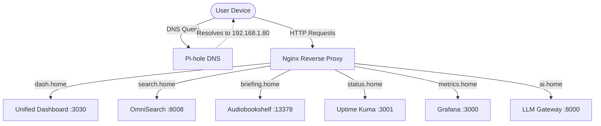

# Unified Internal Reverse Proxy & Local DNS Rewrites

This project implements a lightweight Nginx reverse proxy mapped to human-friendly `.home` domains, simplifying access to various homelab services running on different ports. It includes a utility script to automatically generate Pi-hole v6 FTL local DNS records.

## Architecture



## Domain Catalog

- `dash.home` -> Unified Dashboard (port 3030)
- `search.home` -> OmniSearch Gateway (port 8008)
- `briefing.home` -> Audiobookshelf (port 13378)
- `status.home` -> Uptime Kuma (port 3001)
- `metrics.home` -> Grafana (port 3000)
- `ai.home` -> Local LLM Gateway (port 8000)

## Security
- Internal-only binding.
- Proxy headers (`X-Forwarded-For`, `X-Real-IP`).
- WebSocket upgrade support.
- Zero public exposure.

## Pi-hole Integration

A utility script `generate_pihole_rewrites.py` parses `nginx.conf` and generates local DNS records suitable for Pi-hole's `/etc/pihole/custom.list`.

### Usage

To preview the records:
```bash
./generate_pihole_rewrites.py --target-ip 192.168.1.80 --dry-run
```

To output the records to a file:
```bash
./generate_pihole_rewrites.py --target-ip 192.168.1.80 --output custom.list
```

## Deployment

Deploy the reverse proxy using Docker Compose:

```bash
docker-compose up -d
```
