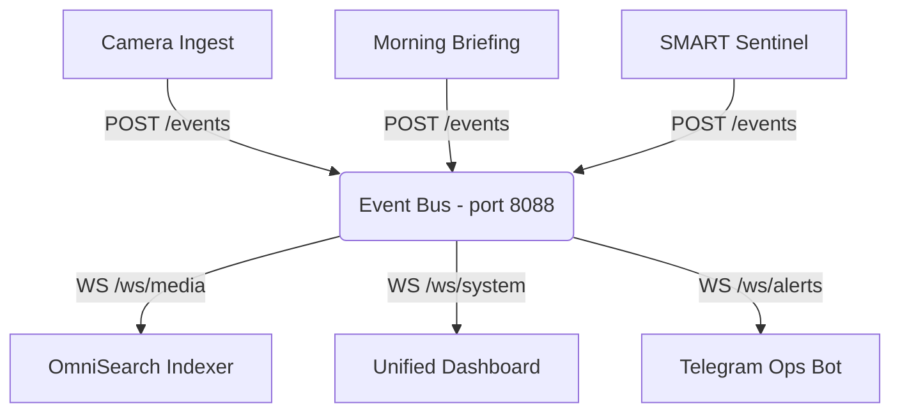

# Project 53: Real-Time Homelab Event Bus & Webhook Gateway

A central nervous system bridging homelab service events. This real-time event bus allows applications to publish events via a simple REST API and broadcasts those events to connected frontend dashboards and listeners via WebSockets.

## Features

- **Ingest**: `POST /events` accepts structured JSON events.
- **Broadcast**: `WS /ws/{topic}` streams real-time events to subscribed clients.
- **Health**: `GET /health` tracks active WebSocket subscribers and total message throughput.
- **Backend Options**: In-memory pub/sub (default), with structural placeholders to adapt to Redis for distributed environments.
- **Safety**: Bounded to 256MB of memory in Docker Compose.

## Architecture & Pub/Sub Diagram



## Standard Homelab Topic Hierarchies

* `media.ingest`: File events (Camera ingest, OCR receipts).
* `system.alerts`: Critical metrics (SLO violations, SMART endurance warnings).
* `briefing.ready`: Daily morning briefing generation complete.
* `automation.state`: Background task completion (e.g., photo curation, backup sync).

## API Examples

### Publish an Event (cURL)

```bash
curl -X POST http://localhost:8088/events \
  -H "Content-Type: application/json" \
  -d '{
    "topic": "system.alerts",
    "source": "smart_sentinel",
    "payload": {
      "level": "critical",
      "message": "NVMe endurance warning: < 5% remaining"
    }
  }'
```

### Subscribe to a Topic (WebSocket Client Example)

```javascript
// Connect to the 'system.alerts' topic
const ws = new WebSocket("ws://localhost:8088/ws/system.alerts");

ws.onmessage = (event) => {
    const data = JSON.parse(event.data);
    console.log(`Received alert from ${data.source}:`, data.payload);
};
```

### Check Health

```bash
curl http://localhost:8088/health
```

Example Output:
```json
{
  "status": "healthy",
  "active_subscribers": 3,
  "messages_processed": 42,
  "backend": "in-memory"
}
```

## Deployment

Deploy using Docker Compose:

```bash
docker-compose up -d
```
