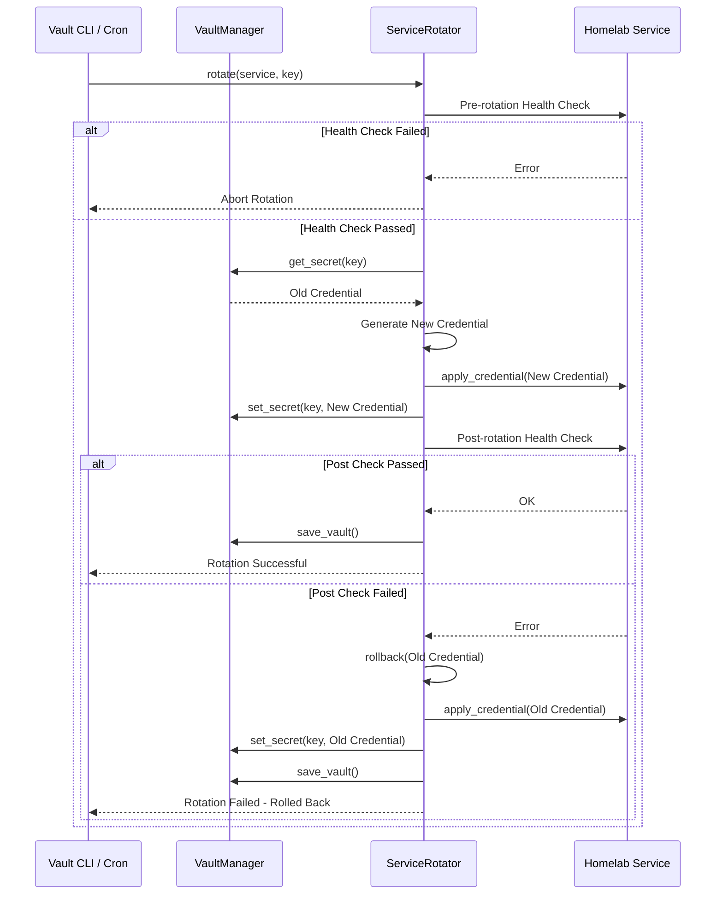

# Project 55: Homelab Secret Vault & Dynamic Credential Rotator

This project provides a centralized, encrypted credential store and automated secret rotation daemon across homelab services (such as Immich API keys, Plex tokens, Telegram bot tokens, WireGuard preshared keys).

## Architecture

The system utilizes AES-256-GCM for authenticated encryption and PBKDF2HMAC (SHA-256) for key derivation. Secrets are dynamically loaded into memory or `tmpfs`, ensuring zero host disk writes.

## Key Derivation Specification

- **Algorithm**: PBKDF2HMAC
- **Hash**: SHA-256
- **Salt**: 16 bytes (randomly generated during `init`)
- **Iterations**: 600,000
- **Key Size**: 32 bytes
- **Cipher**: AES-256-GCM (12 byte nonce, 16 byte auth tag)

## Disaster Recovery / Recovery Key Procedure

In the event of lost access to the running environment or failure of homelab services:
1. Obtain the `vault.json` file securely from backups.
2. Ensure you have the `VAULT_PASSWORD` (Master Password).
3. Set the environment variable: `export VAULT_PASSWORD="your-master-password"`.
4. Run the export command to extract all credentials to `.env` format:
   `python vault_manager.py export-env > recovered.env`
5. Note: This will export plaintext credentials to disk. Ensure the `recovered.env` file is stored securely or within a `tmpfs` mount if required by security policies.
