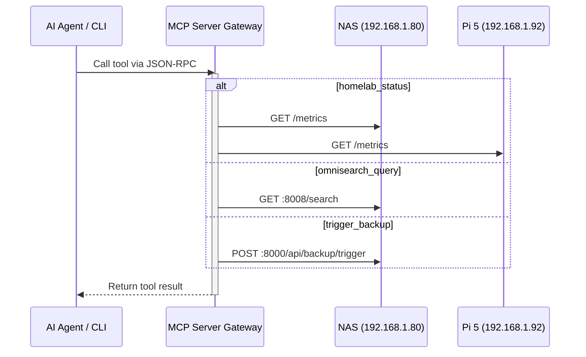

# Project 57: Homelab Unified Model Context Protocol (MCP) Server Gateway

A unified gateway exposing homelab microservices as standard Model Context Protocol (MCP) tools for autonomous AI agents and developer CLIs.

## Architecture



## Tool Catalog

- `homelab_status`: Queries cluster health, node RAM/CPU usage, and temperatures across NAS and Pi 5.
- `omnisearch_query`: Queries semantic multimodal search engine for indexed media and receipts.
- `smart_drive_status`: Queries S.M.A.R.T. Sentinel for NVMe TBW wear and HDD standby states.
- `cluster_services`: Lists active docker containers, endpoints, and health status.
- `trigger_backup`: Dry-run or on-demand trigger for SMR backup orchestrator. (Defaults to dry-run).

## Client Configuration Examples

### Cursor / Claude Code (SSE)
You can configure your agent to point to the SSE transport if running via docker-compose on `http://localhost:8090/sse`.

### Antigravity (Stdio)
```json
{
  "mcpServers": {
    "homelab": {
      "command": "python3",
      "args": ["/path/to/projects/57-homelab-mcp/server.py", "--transport", "stdio"]
    }
  }
}
```