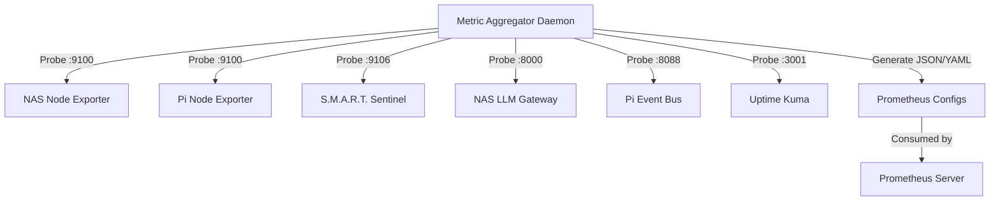

# Project 58: Multi-Host Prometheus Exporter Aggregator & Dynamic Discovery

This project provides a standalone Python daemon that dynamically probes local network metric exporters and generates configurations for Prometheus. It supports outputting fully formed `prometheus.yml` files or `file_sd_configs` target JSON.

## Target Port Registry
- **Node Exporters:** 9100 (NAS, Pi)
- **S.M.A.R.T. Sentinel:** 9106 (NAS)
- **LLM Gateway:** 8000 (NAS, Pi)
- **Event Bus:** 8088 (Pi)
- **Uptime Kuma:** 3001 (NAS)

## Architecture



## Running the Service

Via Docker Compose:
```bash
cd projects/58-metric-aggregator
docker-compose up -d
```

The targets JSON file will be generated in `./output/targets.json`.
You can configure Prometheus to read from this using `file_sd_configs`.
