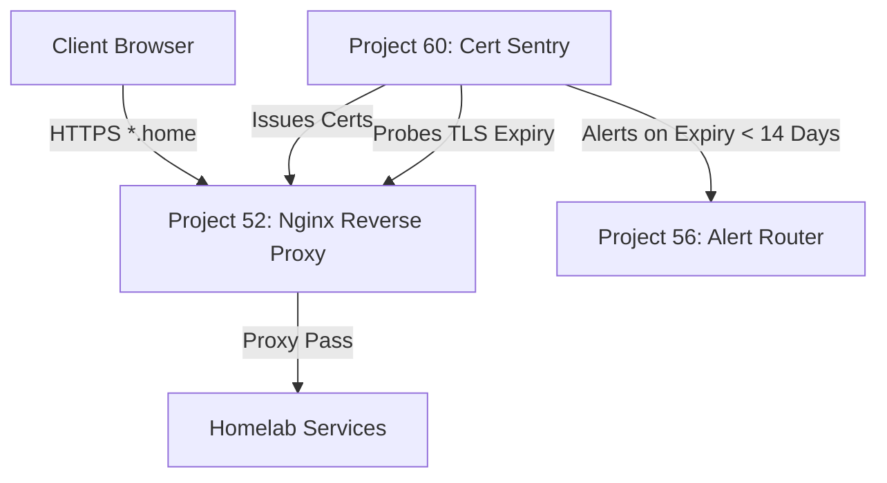

# Project 60: Internal TLS Certificate Authority & Expiry Sentinel

Pairs with Project 52 (Nginx Reverse Proxy) to provide valid internal TLS/SSL certificates for `.home` domains.

## Architecture



## Features
- **Local CA Generator:** Generates self-signed root CA and issues server certificates for `.home` wildcards.
- **TLS Probe:** Actively checks SSL certificate expiry on remote hosts/ports (e.g. 443, 8080, 8443).
- **Proactive Renewal:** Alerts via Project 56 if an endpoint's certificate expires in less than 14 days.

## Installation of Root CA

To avoid browser warnings, you must install the generated `ca.crt` on your client devices.

### macOS
1. Open Keychain Access.
2. Drag and drop `ca.crt` into the "System" keychain.
3. Double-click the certificate, expand "Trust", and select "Always Trust".

### iOS
1. Email or AirDrop `ca.crt` to the device.
2. Go to Settings > Profile Downloaded and install it.
3. Go to Settings > General > About > Certificate Trust Settings and enable full trust for the Root CA.

### Linux (Debian/Ubuntu)
```bash
sudo cp ca.crt /usr/local/share/ca-certificates/homelab_ca.crt
sudo update-ca-certificates
```

## Nginx Reverse Proxy Integration (Project 52)
Point your Nginx configuration to the generated certificates:
```nginx
server {
    listen 443 ssl;
    server_name *.home;

    ssl_certificate /certs/*.home.crt;
    ssl_certificate_key /certs/*.home.key;

    # ...
}
```
