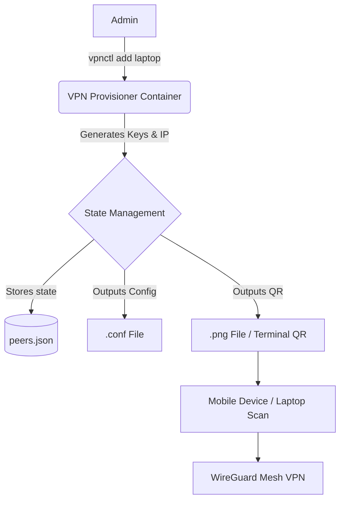

# Homelab WireGuard Dynamic Peer Provisioner & QR Gateway

This project is a lightweight, zero-host-mutation WireGuard peer provisioner designed to seamlessly enroll client devices (smartphones, laptops) into the Homelab WireGuard Mesh VPN (Project 47). It generates secure X25519 keypairs and auto-allocates IP addresses, dispensing them as instant 1-scan QR codes for mobile setup.

## Architecture



## Features
- **Keypair Generation**: Cryptographically secure X25519 private, public, and pre-shared keys generated via the `cryptography` Python library.
- **Dynamic IP Allocation**: Sequentially assigns client IP addresses within the internal WireGuard subnet (`10.66.66.0/24`).
- **QR Code Generation**: Outputs terminal ASCII and `.png` image formats for fast setup.
- **Client Config Builder**: Embeds Endpoint, AllowedIPs (`192.168.1.0/24`, `10.66.66.0/24`), DNS (`192.168.1.80`), and Keepalives.

## Setup & Deployment

The Provisioner is meant to be run containerized to protect host-level state. Run it with a memory-limited Alpine stack.

```bash
docker-compose up -d
```

You can then run the CLI commands inside the container or by invoking it directly.

## Usage

You can use the built-in CLI `vpnctl`.

### Add a Peer
```bash
python provisioner.py add my-iphone
# Adds a peer, auto-allocates an IP, and generates my-iphone.conf + my-iphone.png.
```

### List Peers
```bash
python provisioner.py list
# Outputs table of all peers, IPs, and creation dates.
```

### Display QR Code
```bash
python provisioner.py qr my-iphone
# Displays the terminal ASCII QR code for scanning.
```

### Revoke Peer
```bash
python provisioner.py revoke my-iphone
# Deletes the peer, config, QR, and frees the IP address.
```

## Config Synchronization

To sync these settings dynamically to the active WireGuard interface, the `.conf` generated configurations (public keys and PSKs) stored in the mounted Docker volume should be merged with the active WireGuard configuration, then hot-reloaded using `wg syncconf` or restarting the interface (`wg-quick down wg0 && wg-quick up wg0`), preserving existing zero-downtime mesh policies.

## Mobile Setup Guide (iOS / Android)

1. Download the official **WireGuard** app from the App Store or Google Play Store.
2. Open your terminal and run `python provisioner.py qr my-iphone`.
3. Open the WireGuard app, press the **+** button, and select **"Create from QR code"**.
4. Scan the terminal code, give it a name, and turn it on.
