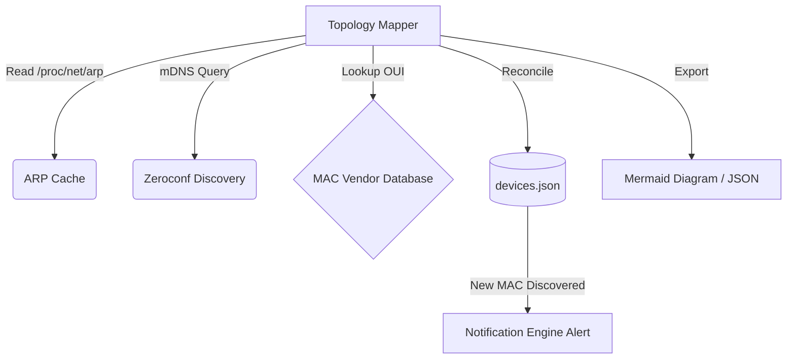

# Project 63: Homelab Network Topology Mapper & Device Discovery

## Overview

The Topology Mapper continuously maps local devices on the subnet (`192.168.1.0/24`) using non-intrusive ARP scans, mDNS/Zeroconf discovery, and MAC vendor lookups. It automatically identifies unknown or rogue MAC addresses and integrates with the Homelab Event Bus / Notification Engine (Project 56) to trigger alerts.

## Architecture



## Features

- **Passive Scanning**: Reads `/proc/net/arp` and uses mDNS to prevent Wi-Fi latency spikes and conntrack table saturation (maintaining < 50 packets/sec).
- **Rogue Device Alerting**: Dispatches alerts when an uncataloged MAC address is detected.
- **Topology Visualizer**: Exports a Mermaid LAN graph or static JSON topology representation.
- **Zero Host Mutation**: Fully isolated Python utility with strict resource limits (128M).

## Configuration

The mapper comes with a basic hardcoded MAC vendor database (OUI mapping). Alerts are dispatched by loading the `AlertRouter` module from Project 56, if it exists in the relative path. Ensure Project 56 is configured properly with NTFY and/or Telegram credentials to receive the alerts.

## Usage

```bash
# Run a dry-run test
python topology_mapper.py --scan-now --dry-run

# Run and output Mermaid diagram
python topology_mapper.py --scan-now --output ./data

# Output in JSON format
python topology_mapper.py --scan-now --json --output ./data
```

## Docker

A `docker-compose.yml` is provided to run the mapper as a scheduled service, executing a scan every 5 minutes (300 seconds). It requires `network_mode: host` to read the ARP cache and listen for mDNS packets correctly.
