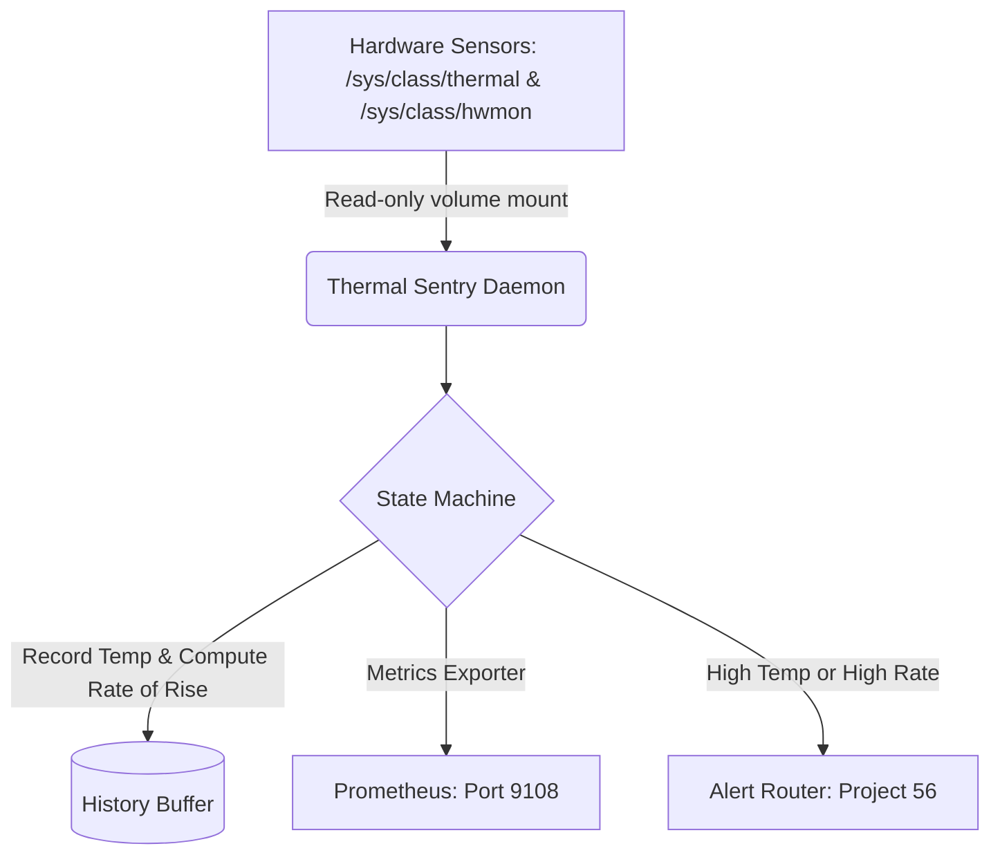

# Project 64: Homelab Thermal Throttle & Fan Governor Sentry

## Overview

The Thermal Throttle & Fan Governor Sentry continuously monitors hardware thermal sensors (CPU, NVMe, HDD) using raw `/sys` node mapping. It maintains a multi-stage thermal curve using hysteresis zones, exposes system temperatures as Prometheus metrics (port 9108), and alerts the local Notification Engine (Project 56) when a critical threshold or a rapid rate-of-rise event (>5°C/min) is detected.

## Directives Implemented

- **Hardware Context**: Monitors standard ecosystem sensors including Intel/ARM CPUs, WD_BLACK SN850X NVMe (optimal < 60°C), and Seagate IronWolf HDDs.
- **Zero Host Mutation**: Executes strictly as a read-only container mounted to the `/sys` file system.

## Hysteresis & Thermal Curve Zones

| Thermal State | Threshold | Action |
| ------------- | --------- | ------ |
| **COOL** | < 40°C | None |
| **OPTIMAL** | 40°C - 54.9°C | None |
| **WARM** | 55°C - 64.9°C | Triggers `WARNING` alert |
| **CRITICAL**| >= 65°C | Triggers `CRITICAL` alert |

**Note**: In addition to absolute thresholds, a rate-of-rise exceeding `5°C/min` will trigger an immediate early warning alert.

## Architecture



## Running the Container

The application is deployed via Docker Compose:

```bash
cd projects/64-fan-governor
docker-compose up -d
```

## Prometheus Metrics

- `homelab_cpu_temp_celsius`
- `homelab_nvme_temp_celsius`
- `homelab_hdd_temp_celsius`
- `homelab_thermal_state` (0=Cool, 1=Optimal, 2=Warm, 3=Critical)

## Command Line Testing

You can dry-run the tool locally to check sensor states and rate limits:

```bash
python thermal_sentry.py --status --json
python thermal_sentry.py --dry-run --interval 10
```
