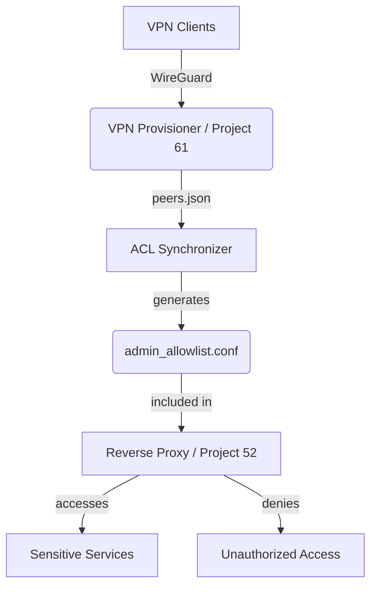

# Project 65: Zero-Trust Access Control & Reverse Proxy Allowlist Synchronizer

This project enforces zero-trust IP allowlisting on sensitive internal admin services (Code-Server port 8443, Portainer, Grafana port 3000, Pi-hole admin).

It dynamically bridges with WireGuard provisioner (Project 61) and Tailscale subnets to generate Nginx access control rules. This tool operates under a strict "Zero Host Mutation" directive by emitting configuration snippets strictly into mounted volumes.

## Architecture & Trust Boundary



## Nginx Include Directive

To apply the generated allowlist, include the output snippet inside the sensitive service server blocks in `nginx.conf`:

```nginx
server {
    listen 80;
    server_name admin.home;

    # Include dynamic ACL
    include /path/to/nginx-snippets/admin_allowlist.conf;

    location / {
        proxy_pass http://192.168.1.80:8443;
    }
}
```

## Emergency Bypass

In the event of an emergency where VPN access is down or the dynamic ACL locks out legitimate administrators, you can bypass the restriction by manually overwriting the `admin_allowlist.conf` snippet with an open allow rule, or by commenting out the `include` directive in the Nginx configuration and restarting Nginx.

```bash
echo -e "allow all;" > /path/to/nginx-snippets/admin_allowlist.conf
nginx -s reload
```