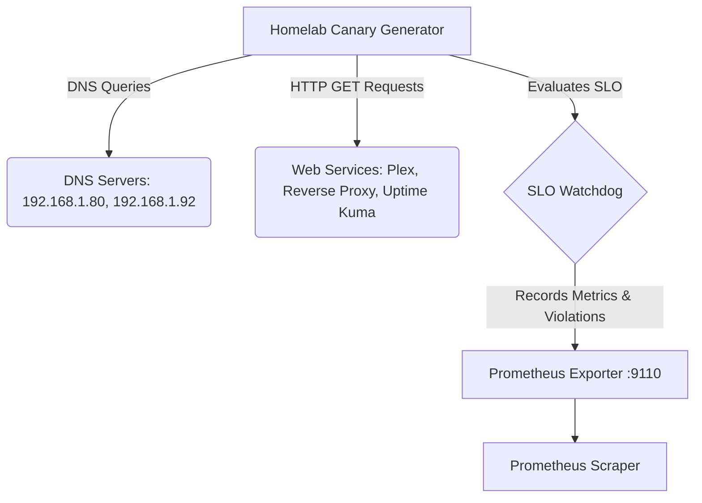

# Homelab Synthetic Canary Traffic Generator & DNS/HTTP Latency Benchmark

This project is a containerized Python utility for continuously probing internal DNS servers and internal web services to detect latency degradation, DNS resolver timeouts, or HTTP 5xx errors before users notice.

## Architecture & Data Flow



## SLO Directives

- **Homelab DNS SLO:** Query latency must be `<50ms`. Latency `>500ms` is a SEV-1/SEV-2 incident.
- **Non-Intrusive Rate Limit:** Strictly low probe frequency (1-5 req/interval, max 10 req/sec) to avoid conntrack table saturation or CPU impact.

## Alerting Rules (Prometheus)

```yaml
groups:
  - name: HomelabCanaryAlerts
    rules:
      - alert: HighDNSLatency
        expr: homelab_canary_dns_latency_ms > 500
        for: 5m
        labels:
          severity: critical
        annotations:
          summary: "High DNS Latency on {{ $labels.server }}"
          description: "DNS resolution for {{ $labels.domain }} took more than 500ms."

      - alert: SLoViolations
        expr: rate(homelab_canary_slo_violation_count[5m]) > 0
        for: 5m
        labels:
          severity: critical
        annotations:
          summary: "SLO Violation Detected"
          description: "SLO violations are occurring for {{ $labels.type }} on target {{ $labels.target }}."
```

## Running the Canary

### CLI
```bash
python canary.py --help
python canary.py --probe-now --json --dry-run
python canary.py --interval 60
```

### Docker
```bash
docker-compose up -d
```
