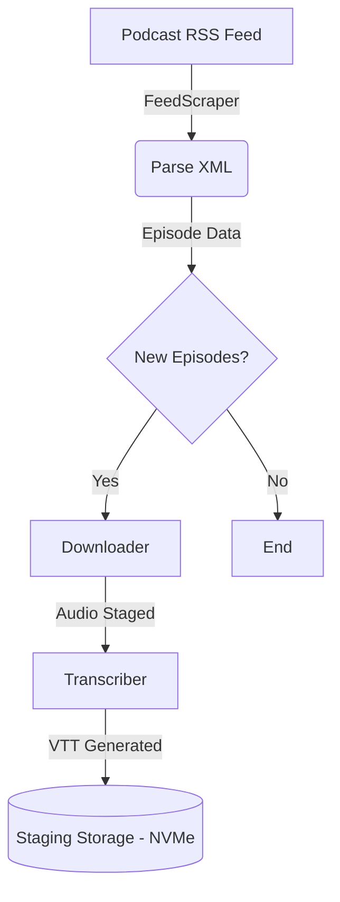

# Audiobookshelf Podcast RSS Scraper & Transcriber

An automated podcast RSS downloader and speech-to-text transcript generator for Audiobookshelf, designed to embed searchable VTT/SRT transcripts.

## Architecture

This utility acts as a containerized Python isolated worker daemon. It scrapes RSS feeds, downloads audio files to a staging directory, and generates WEBVTT transcripts.

### Ingestion Pipeline



## Storage Directives

- **Storage Tiering**: Ensure that the output directory for audio files is staged on an NVMe tier (e.g. `/volume2` or local staging). Never thrash mechanical HDDs with constant writes for temporary files or transcripts.

## Workload Throttling (Pi 5 Safe)

Transcriptions and downloads can consume significant resources. When running this worker via Docker, strictly enforce memory and CPU limits.

### Docker Compose Throttling Parameters

```yaml
deploy:
  resources:
    limits:
      memory: 256M
      cpus: '0.50'
```

## Usage

```bash
python podcast_transcriber.py --feed-url <url> --output-dir <path> [--limit <n>] [--dry-run]
```

## Audiobookshelf Integration

Once the MP3s and WEBVTT files are downloaded into the staging directory, Audiobookshelf can ingest them. Configure Audiobookshelf to scan this staging directory as a Podcast library, ensuring it reads the matching `.vtt` sidecar files as subtitles.
