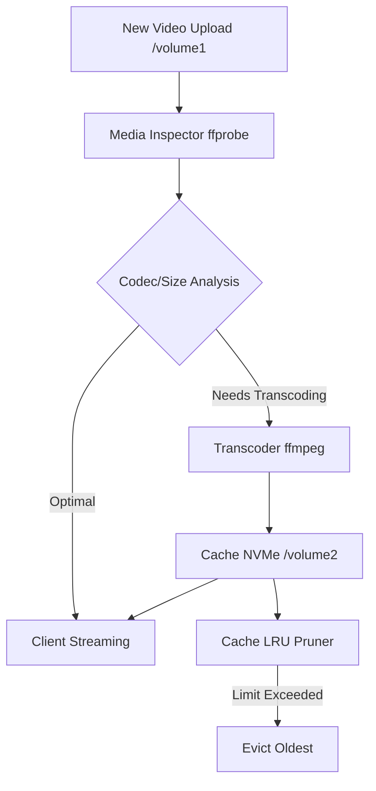

# Automated Immich Video Transcoding & H.265 Cache Manager

This project optimizes mobile phone video uploads (4K 60fps, ProRes, HEVC) for seamless low-latency remote streaming and TV playback without server buffering, while protecting mechanical HDDs from random read churn through asymmetric tiering.

## Architecture

This solution employs a containerized Python utility running as a zero-host mutation to inspect, transcode, and manage cached video files.

### Asymmetric Tiering
- **Source Media:** Stored on mechanical HDDs (e.g., `/volume1`), accessed via read-only bind mounts to adhere to the Zero-Copy Principle.
- **Transcode Cache:** Stored strictly on an NVMe SSD tier (e.g., `/volume2/cache`) to handle random read/write churn without impacting HDD lifespan or performance.

### Hardware Acceleration
Configured primarily for Intel N100 QuickSync Video (QSV) accessible via `/dev/dri`, with CPU fallback for other environments like Raspberry Pi 5. Ensure the container has `/dev/dri` passed through and the host has the necessary drivers.

### Cache LRU Pruner
The transcode cache size is tracked. When it exceeds a configured limit (e.g., 50GB), the manager evicts the least recently accessed transcodes based on access time to free up space.

## Transcode Workflow

## Setup & Usage

1. **Prerequisites:** Docker and Docker Compose.
2. **Run:** Deploy the stack using `docker-compose up -d`.
3. **Command Line Utility:** Use `video_cache_manager.py` directly for manual intervention.
    - `--input <path>`: Path to input video file.
    - `--cache-dir <path>`: Directory to store transcoded cache.
    - `--max-cache-gb <n>`: Maximum cache size in GB.
    - `--dry-run`: Print commands instead of executing them.
    - `--clean-cache`: Force clean cache to respect limit without encoding.
