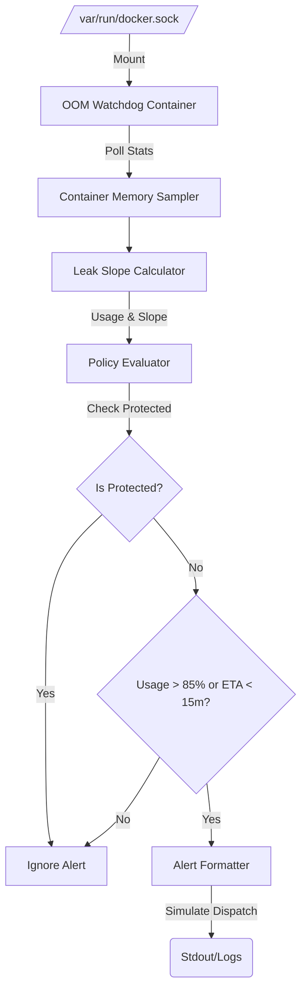

# Project 69: Docker Container Memory Leak & OOM Killer Watchdog

Continuous memory utilization and leak trend analysis for Docker containers across UGREEN NAS (8GB RAM) and Raspberry Pi 5 (16GB RAM) to prevent catastrophic OOM killer events.

## Features

- **Container Memory Sampler**: Inspects container memory usage via the Docker API socket. Subtracts cache/inactive file memory to capture actual application usage.
- **Leak Slope Calculator**: Calculates rate of memory growth (MB/minute) across historical samples to distinguish legitimate spikes from continuous leaks.
- **Policy Evaluator**: Flags impending OOM risk when usage exceeds 85% limit, or the rate of growth indicates an OOM event will occur within 15 minutes.
- **Protected Containers**: Core infrastructure services are explicitly protected and NEVER automatically targeted for alerts that might imply termination, or ignored if they are known false positives. Protected services include: `pihole`, `unbound`, `reverse-proxy`, `uptime-kuma`.

## Architecture Guide

## Setup & Deployment

1. Make sure you have Docker and Docker Compose installed.
2. Run `docker-compose up -d` to build and start the watchdog.
3. The watchdog runs with a memory limit of `128m` to prevent it from contributing to OOM issues.

## CLI Flags

- `--check-now`: Run a single check immediately.
- `--interval <sec>`: Interval between checks in seconds.
- `--json`: Output alerts in JSON format.
- `--dry-run`: Do not dispatch alerts, just log them.

