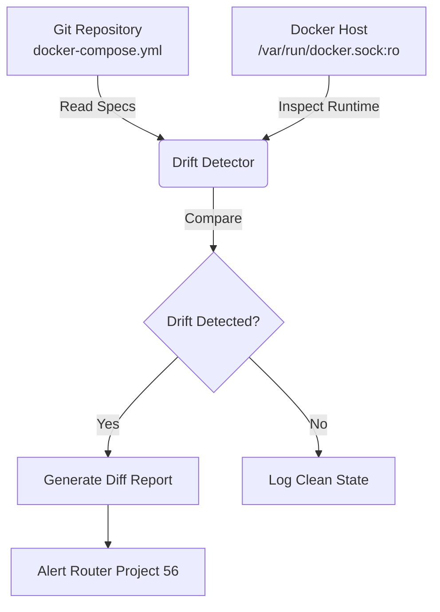

# Project 70: Homelab Unified Config Drift Detector & GitOps Sync Sentry

## Overview
This project provides a drift detector that continuously compares the running state of Docker containers against the repository-declared `docker-compose.yml` files. It operates across homelab devices (like UGREEN NAS and Raspberry Pi 5) to detect out-of-band configuration changes, uncommitted environment variable modifications, or outdated image tags.

## Architecture

The detector operates in a strict read-only, zero-mutation manner. It mounts the Docker socket in read-only mode to inspect running containers and compares them to the source of truth (`docker-compose.yml` files) in the Git repository.

### GitOps Reconciliation Flow



## Drift Alert Schemas

When drift is detected, the utility can output a structured JSON payload for alerting integration.

```json
{
  "timestamp": "2023-10-25T12:00:00Z",
  "service": "my-service",
  "drift_type": "image_mismatch",
  "expected": "my-image:v1.0",
  "actual": "my-image:latest",
  "host": "ugreen-nas"
}
```

Other `drift_type` values include:
- `port_mismatch`: When exposed ports do not match.
- `volume_mismatch`: When volume mounts do not match.
- `missing_service`: When a service defined in compose is not running.
- `env_mismatch`: Uncommitted or modified environment variables.

## Remediation Runbooks

1. **Uncommitted Configuration Change**:
   - If drift is detected due to a manual change on the server (e.g., changing an image tag via CLI), commit the change to the Git repository to reflect the new desired state, or revert the change on the server to match Git.

2. **Outdated Image Tag**:
   - If a container is running an outdated image compared to the repo (e.g., due to a failed CD pipeline), pull the latest image and recreate the container using standard GitOps deployment processes.

3. **Missing Service**:
   - Verify if the service was intentionally stopped. If not, investigate the container logs and restart the service via `docker-compose up -d`.
