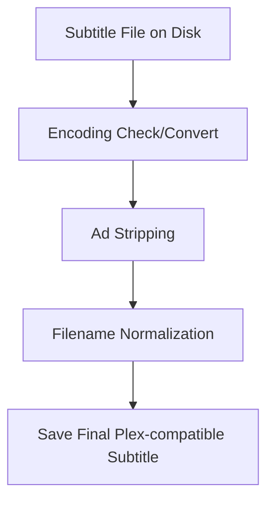

# Plex Automated Subtitle Synchronizer & Cleaner

This utility cleans external SRT/VTT subtitles, removes embedded ads, converts encodings to UTF-8, and normalizes subtitle naming to the standard Plex format.

## Architecture Pipeline



## Features
- **Encoding Converter**: Detects non-UTF8 encodings and safely converts to UTF-8.
- **Subtitle Cleaner**: Strips promotional URLs and watermarks.
  Regex patterns include:
  - `https?://`
  - `www\.`
  - `\.com`
  - `opensubtitles`
  - `yify`
  - `yts`
  - `downloaded from`
- **Filename Normalizer**: Standardizes names to `<Title> (<Year>).<lang>.<forced>.srt` to seamlessly integrate with Plex.

## Usage
Run via Python or Docker.

### Python CLI
```bash
python subtitle_sync.py --path /media/Movies --clean-ads --convert-utf8
```

Options:
- `--path`: Directory to process
- `--clean-ads`: Strip promotional lines/watermarks
- `--convert-utf8`: Convert files to UTF-8
- `--dry-run`: Output actions without making disk changes

### Docker
```bash
docker-compose up
```
