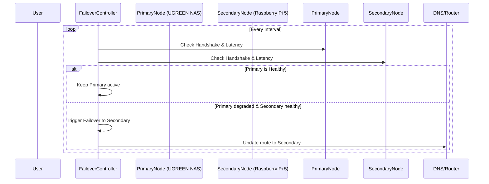

# High-Availability WireGuard Failover

This project provides a robust solution for ensuring continuous remote access by dynamically monitoring WireGuard tunnels hosted across a UGREEN NAS and a Raspberry Pi 5.

## Architecture Guide

The failover agent constantly monitors the health of WireGuard endpoints by:
1. Parsing `wg show all dump` for the last handshake age.
2. Pinging the peer for latency checks.
3. Exposing a Prometheus metrics endpoint on port 9112 to visualize tunnel health and failover metrics.

If the primary node becomes unresponsive based on the thresholds below, the script triggers a failover, redirecting internal/external requests to the secondary node.

### Health Check Thresholds
- **Handshake Age**: Must be < 60 seconds.
- **ICMP Latency**: Round-trip time must be < 50ms.

## Mermaid HA Failover Sequence

## State Transitions
- `Primary Active`: Both nodes are healthy, or only primary is healthy. Traffic is directed to the primary node.
- `Failover Triggered`: Primary node is degraded (handshake > 60s or ping timeout/latency > 50ms), but secondary is healthy. The active node shifts to secondary.
- `Primary Restored`: Primary node becomes healthy again. The active node shifts back to primary.
