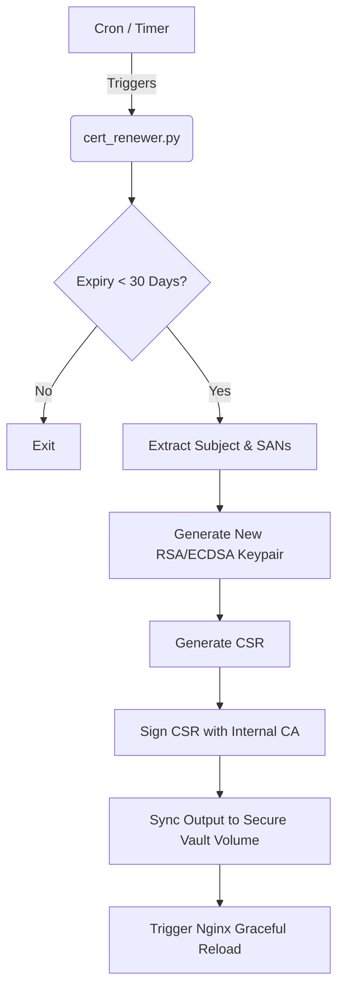

# Automated Homelab SSL/mTLS Certificate Renewer (Project 75)

## Overview
This ecosystem component provides an automated TLS certificate renewal daemon for internal homelab services. It seamlessly integrates with Internal CA (Project 60), Reverse Proxy (Project 52), and Secret Vault (Project 55).

## Zero Downtime Directives
- **Validity Evaluation:** Proactively evaluates certificates and triggers automated renewal when validity drops below 30 days.
- **Zero Downtime Reload:** Integrates with your host environment to prevent dropped TLS streams upon rotation. 
- **Zero Host Mutation:** Runs as a fully isolated, containerized Python utility.

## Renewal Architecture Diagram



## SAN Configuration
The renewer automatically carries over Subject Alternative Names (SANs) from the old certificate to ensure multi-domain setups aren't disrupted. Ensure your existing certificate has the correct SANs defined during initial provisioning.

## Nginx Graceful Reload
Once the certificate is synced, you must tell your Reverse Proxy to reload without dropping connections:

```bash
docker exec nginx-proxy nginx -s reload
```
(Or use a sidecar/notifier depending on your setup).

## Usage

```bash
python cert_renewer.py \
    --cert-file /path/to/server.crt \
    --ca-cert /path/to/ca.crt \
    --ca-key /path/to/ca.key \
    --days 30 \
    --dry-run
```
