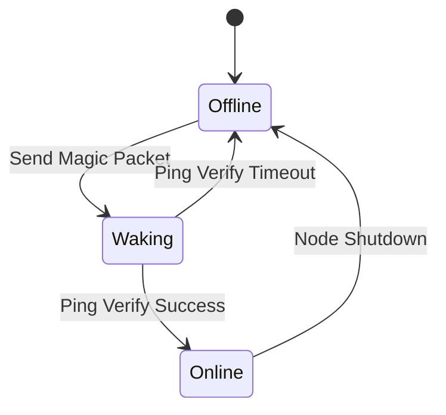

# Local Wake-on-LAN (WoL) Magic Packet Sentry

Isolated containerized Python utility that dispatches and logs Wake-on-LAN (WoL) magic broadcast packets across subnet 192.168.1.0/24 to wake sleeping workstations or compute nodes on demand.

## Architecture Guide

### WoL State Machine

### Magic Packet Format

The magic packet is a 102-byte frame constructed with:
- 6 bytes of all `0xFF`
- 16 repetitions of the target device's 6-byte MAC address

### API Integration / CLI

- `--wake <target_name_or_mac>`: Sends magic packet.
- `--list`: Lists all registered targets.
- `--dry-run`: Constructs packet but doesn't send.
- `--json`: Outputs response in JSON format.
