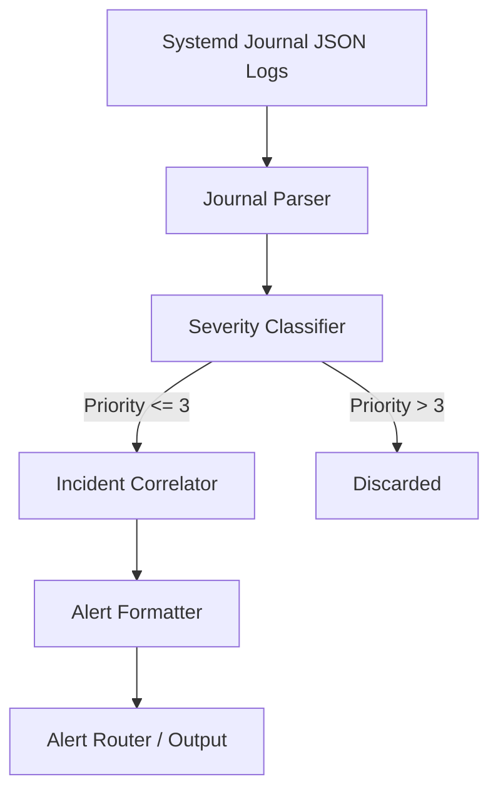

# Multi-Node Systemd Journal Log Aggregator & Filter

This project parses, filters, and correlates systemd journal logs across nodes (UGREEN NAS, Raspberry Pi 5) to detect hardware kernel errors, OOM invocations, and service crash loops.

## Architecture Pipeline

## Features and Filtering Rules

- **Noise Reduction**: Filters repetitive informational notices, emphasizing priority levels <= 3 (Emerg, Alert, Crit, Err).
- **Incident Correlator**: Detects rapid-fire errors (>10 in 60s) from a single unit and flags cascade failures.
- **Lightweight**: Read-only access to `/var/log/journal:ro` with `<128M` memory footprint.

## Alert Format Schema

Alert events are emitted with the following schema:
`ALERT [CASCADE FAILURE]: [<PRIORITY>] <SUBSYSTEM>: <MESSAGE>`

Or structured as JSON using the `--json` flag.
