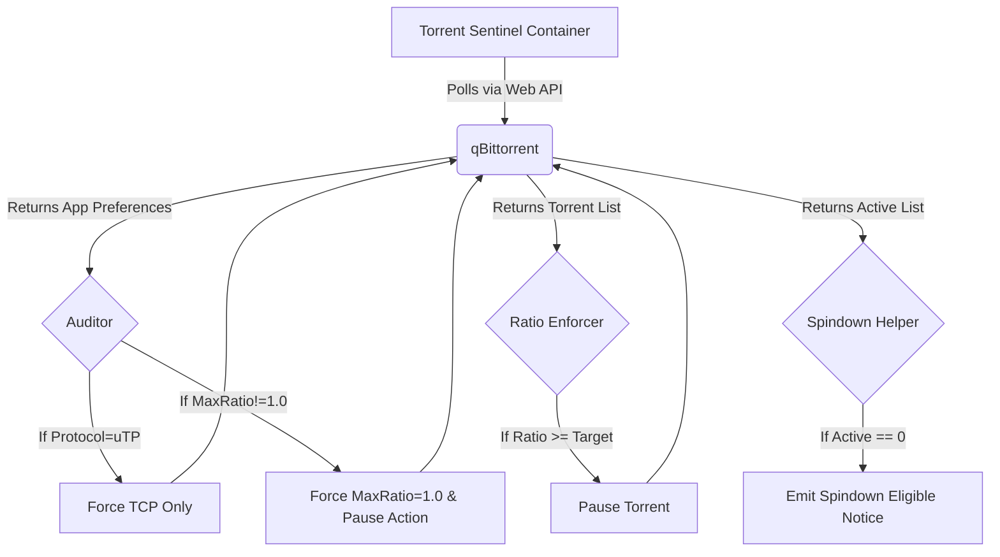

# qBittorrent Conntrack & Ratio Enforcer Watchdog (Torrent Sentinel)

Torrent Sentinel is an isolated, containerized Python utility designed to protect core network and storage infrastructure by automatically auditing and enforcing safety limits on qBittorrent via its Web API.

## Core Directives & Rationale

### 1. Protocol Enforcement: uTP vs TCP
BitTorrent clients often default to using uTP (Micro Transport Protocol), which operates over UDP. In high-peer environments, this can lead to a connectionless state explosion in router NAT conntrack tables, causing network instability or router crashes. Torrent Sentinel mitigates this by validating that qBittorrent enforces TCP-only transport (`BittorrentProtocol=1`). TCP states are explicitly managed by the router and drop cleanly, protecting conntrack tables.

### 2. Storage & Ratio Protection
Mechanical hard drives, especially SMR (Shingled Magnetic Recording) drives, suffer from severe performance degradation and wear under the random read/write churn typical of torrenting. By enforcing a strict 1:1 seed ratio (`GlobalMaxRatio=1.0`) with auto-pause (`GlobalMaxRatioAction=0`), this utility limits continuous read loads and frees up NAT translation slots immediately when parity is reached.

### 3. Inactive Pause & HDD Deep-Sleep
Mechanical drives (like Seagate IronWolf) can enter 0 RPM deep sleep hibernation to save power and extend lifespan, but only if they are entirely inactive. Sentinel pauses stalled/completed torrents when seeding exceeds the ratio ceiling and emits notifications when zero active torrents remain. This signals to storage sentinels that the drives are eligible for spindown.

## Architecture Workflow



## CLI Usage

Run the utility locally or inside its container:

```bash
python torrent_sentinel.py --check-now --api-url http://localhost:8080 --target-ratio 1.0
```

Flags:
- `--check-now`: Run a check immediately.
- `--api-url <url>`: Endpoint for qBittorrent Web API (default: `http://localhost:8080`).
- `--target-ratio <float>`: The ratio limit to enforce (default: `1.0`).
- `--dry-run`: Evaluate limits without making changes.
- `--json`: Output results in JSON format.

## Deployment

A lightweight `docker-compose.yml` is provided to run Torrent Sentinel as an isolated sidecar alongside qBittorrent, strictly limiting its resources (128M RAM).
